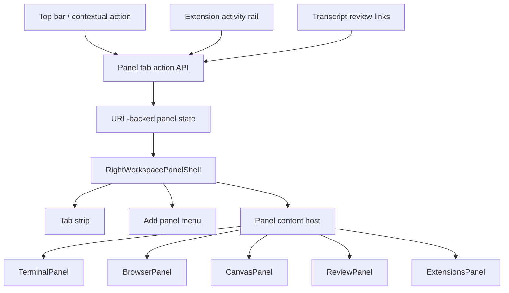

# refactor: Add tabbed right-side workspace panel

## Summary

Replace the current one-panel-at-a-time right side with a shared, content-agnostic workspace panel shell that can host multiple panel tabs. Users can open surfaces such as Terminal, Browser, Canvas, Review, and Extensions from a compact add menu, switch between active tabs, and close tabs without losing useful panel state.

---

## Problem Frame

The current shell exposes separate top-bar buttons for each right-side panel surface and stores a single active item in URL state. That makes Terminal, Browser, Canvas, Review, and Extensions mutually exclusive even though the product is a local workbench where adjacent panels should remain close at hand. The requested direction is a neutral right-side panel that opens from the right, lets the user choose which surface to add, and manages those surfaces as tabs across the top.

The supplied design references point toward two important interaction qualities: a compact add menu for choosing panel content, and a calm empty/opening state with large target rows for common panels. This plan preserves the existing panel experiences where possible and moves the opinionated behavior into a panel registry plus tab lifecycle.

---

## Requirements

**Panel Shell**

- R1. The right side has one shared panel shell that owns width, open/closed state, resize behavior, tab chrome, empty state, and add-menu affordance.
- R2. The shell can host multiple active panel tabs at once and lets users switch tabs without closing the other tabs.
- R3. Each tab can be closed independently; closing the active tab selects a predictable neighboring tab or closes the shell when none remain.
- R4. The add menu presents available panel items with icon, title, short description, and keyboard hint where a shortcut exists.

**Existing Panel Behavior**

- R5. Terminal, Browser, Canvas, Review, and Extensions remain available as panel items with their existing core behavior.
- R6. Switching away from a panel tab preserves useful local state where the existing component can safely remain mounted, especially terminal process state, browser bounds/session state, canvas marks, review selection, and extension panel selection.
- R7. Existing contextual entry points that open Review for thread, turn, or branch changes still open Review with the intended scope inside the new tabbed shell.
- R8. Extension activity remains visible and can open the Extensions tab while retaining the selected extension context.

**State, Navigation, and Design**

- R9. URL state represents the open tab list and active tab so panel layout survives refresh/shareable navigation without using "tool" terminology for this UI layer.
- R10. New route state may replace the existing single-panel query value directly; no legacy compatibility path is required.
- R11. Opening, switching, and closing the panel follows `docs/design.md`: compact, adjacent to the thread, stable in placement, and animated only enough to explain state change.
- R12. The implementation uses local shadcn-style wrappers and Base UI-compatible primitives already present in the app; it does not introduce Radix UI or unnecessary dependencies.

---

## High-Level Technical Design



The shell is intentionally content-agnostic. A panel registry describes available panel items, icons, labels, add-menu metadata, and render functions. The shell manages tab identity, selection, close behavior, and layout; each hosted panel component keeps its existing domain concerns.

The URL state should move away from the active `tool` value to panel-specific terminology:

```text
panelTabs: ordered panel entries
panelActive: selected tab id or panel key
rightWidth: shared right panel width
reviewScope / reviewTurnId / reviewPath: retained review-specific state
extension / extensionPanel: retained extension-specific state
```

The exact serialization can be finalized during implementation, but it should avoid "tool" naming for this UI concept and avoid turning review/extension substate into tab-shell concerns.

---

## Key Technical Decisions

- KTD1. Shared shell, panel registry, panel-owned content: Keep the new panel shell neutral and put panel-specific rendering behind a registry. This avoids duplicating width, resize, tab, empty, and close behavior across every panel item while keeping Terminal, Browser, Canvas, Review, and Extensions independent.
- KTD2. URL-backed tabs with panel terminology: Extend route search state to represent tab order and active tab using panel-specific names, replacing the existing single `tool` UI state. The current app already uses `nuqs` for layout state, so this preserves the existing navigation model without carrying the overloaded "tool" convention forward.
- KTD3. Preserve by mounting inactive tabs where needed: Prefer keeping active tabs mounted and hiding inactive tab panels with accessibility-safe attributes. This protects terminal, browser, canvas, review, and extension state from being destroyed on tab switches.
- KTD4. Contextual openers add-or-focus tabs: Existing actions such as "review thread changes", extension rail selection, and top-bar panel choices should focus an existing matching tab if present, otherwise add it. This keeps repeated clicks predictable and avoids duplicate tabs unless a future feature explicitly supports multiple instances of the same panel item.
- KTD5. Motion is local and purposeful: Animate shell open/close and tab add/remove/selection only enough to explain the layout change, using named timing constants and reduced-motion handling per `docs/design.md` and Interface Craft guidance.

---

## Scope Boundaries

### In Scope

- Replace the current top-right individual panel toggle cluster with a panel-entry/add-menu model.
- Introduce a reusable right-side panel shell with tab strip, add menu, empty state, close controls, and shared resize handling.
- Adapt Terminal, Browser, Canvas, Review, and Extensions into hosted panel tabs without changing their core feature behavior.
- Preserve current review, extension, browser attach, canvas attach, and terminal behavior as much as possible inside the new model.
- Add focused tests for panel state transitions and route parsing.

### Deferred to Follow-Up Work

- Multiple independent instances of the same panel type, such as two browser tabs or multiple terminals.
- New panel experiences beyond the existing Terminal, Browser, Canvas, Review, and Extensions surfaces.
- Persisting panel tab sets outside route state, such as per-thread saved layouts.
- Drag-reordering tabs. The first version should keep tab ordering simple and deterministic.

---

## System-Wide Impact

This change affects the app shell, route search state, top-bar controls, contextual review openers, and extension rail behavior. It should not require app-server API changes because the existing hosted panel components already own their IPC and data-fetching behavior. The highest-risk areas are preserving long-lived local panel state while switching tabs and keeping route state clear after removing the overloaded UI `tool` concept.

---

## Implementation Units

### U1. Model Workspace Panel Tabs in Route State

**Goal:** Replace the single active right-side item model with a URL-backed panel tab state model that can represent ordered open tabs and the active tab.

**Requirements:** R1, R2, R3, R9, R10

**Dependencies:** None

**Files:**

- `src/lib/route-search.ts`
- `test/route-search.test.ts`
- `src/hooks/use-app-shell-controller.ts`
- `src/components/top-bar.tsx`

**Approach:** Add a typed panel tab model that can parse, normalize, and serialize an ordered set of supported panel tabs. Replace the existing `tool` query concept with panel-specific naming rather than preserving backwards compatibility. Expose controller actions for add/focus/close/select instead of toggle-only panel behavior.

**Execution note:** Start with route-state tests for default empty tabs, panel tab parsing, add/focus behavior, active tab fallback after close, and invalid tab values.

**Patterns to follow:** Existing `routeSearchParsers`, `mergeRouteSearchUpdate`, width bounds, and `useAppShellController` URL update style.

**Test scenarios:**

- Given no panel-related URL values, normalization returns no active tabs and keeps existing layout defaults.
- Given a URL with panel tab state, normalization yields the requested tab order and selected active tab.
- Given a tab list containing unsupported panel values, normalization drops invalid entries and selects the first valid remaining tab.
- Given the active tab is closed, the state helper selects the nearest remaining tab; if no tabs remain, the shell is closed.
- Given a panel item is opened twice through the action API, the existing tab is focused rather than duplicated.

**Verification:** Route-state behavior is covered by unit tests, and controller props no longer require top-level one-button-per-panel toggle semantics or UI `tool` naming.

### U2. Build the Neutral RightWorkspacePanelShell

**Goal:** Create the shared right-side panel component that owns layout, resize handle, tab strip, add menu, empty state, close behavior, and panel content slots.

**Requirements:** R1, R2, R3, R4, R11, R12

**Dependencies:** U1

**Files:**

- `src/components/app-shell-layout.tsx`
- `src/components/right-workspace-panel-shell.tsx`
- `test/right-workspace-panel-shell.test.tsx`
- `src/components/ui/dropdown-menu.tsx`
- `src/components/ui/button.tsx`
- `src/style.css`

**Approach:** Extract the current `ToolPanelHost` responsibility into a shell component that receives tab state, registry entries, selected tab id, width, resize callback, and render context. The shell should render a tab strip across the top, an add button/menu using existing dropdown primitives, and an empty state inspired by the references when no tabs are open. Keep the resize handle attached to the shared shell so width is independent of the selected panel item.

**Execution note:** Implement shell state behavior test-first with a small harness before wiring real panel contents.

**Patterns to follow:** Existing `ToolPanelHost` width handling, top-bar button sizing, dropdown menu styling, and `docs/design.md` guidance for compact durable workbench surfaces.

**Test scenarios:**

- Given no tabs are open, the shell renders the add/empty state with available panel actions.
- Given multiple tabs are open, the tab strip shows each tab, marks the active tab, and renders only the active tab as visible to assistive tech.
- Given a tab close button is clicked, the shell calls the close action with the correct tab id without triggering tab selection accidentally.
- Given reduced motion is preferred, open/close and tab transitions do not rely on motion to communicate state.
- Given the viewport is narrow but within app minimums, tab labels truncate and controls remain reachable without overlapping.

**Verification:** Component tests cover tab lifecycle callbacks, and visual/browser verification confirms the shell resembles the supplied references without crowding the transcript.

### U3. Adapt Existing Panels into Registry Entries

**Goal:** Host Terminal, Browser, Canvas, Review, and Extensions inside the new shell with a consistent registry and preserved state.

**Requirements:** R5, R6, R7, R8

**Dependencies:** U1, U2

**Files:**

- `src/components/app-shell-layout.tsx`
- `src/components/right-workspace-panel-registry.tsx`
- `src/components/terminal-panel.tsx`
- `src/components/browser-panel.tsx`
- `src/components/canvas-panel.tsx`
- `src/components/review-panel.tsx`
- `src/components/extensions/extensions-panel.tsx`
- `src/hooks/use-app-shell-controller.ts`
- `test/extension-sidebar.test.ts`
- `test/review-panel-ui.test.ts`

**Approach:** Define registry entries with `id`, `title`, `description`, icon, optional shortcut label, and render function. Keep existing panels mostly unchanged, but remove redundant per-panel outer borders or headers where the shell now provides the containing frame. Inactive mounted panels should be visually hidden and inert so state persists without creating duplicate focus targets.

**Patterns to follow:** Current panel props and data flow in `ToolPanelHost`, extension selection in `ExtensionsPanel`, review scope flow in `ReviewPanel`, and attachment callbacks in `BrowserPanel` and `CanvasPanel`.

**Test scenarios:**

- Given Browser is opened and then another panel tab is selected, returning to Browser keeps its URL/snapshot state where the existing browser manager supports it.
- Given Terminal is opened and another panel tab is selected, returning to Terminal does not restart the terminal process solely because of tab switching.
- Given Review is opened from thread, turn, and branch entry points, the Review tab receives the intended scope and selected path state.
- Given an extension is selected from the activity rail, the Extensions tab opens or focuses with that extension selected.
- Given a panel is inactive, its focusable controls are not reachable by keyboard until the tab becomes active.

**Verification:** Existing review and extension unit tests remain green, and manual/browser verification confirms tab switching preserves state for the high-value panels.

### U4. Redesign Top-Bar and Contextual Entry Points

**Goal:** Replace the independent top-right panel buttons with a compact panel affordance and add-menu behavior matching the design references.

**Requirements:** R4, R7, R8, R11

**Dependencies:** U1, U2, U3

**Files:**

- `src/components/top-bar.tsx`
- `src/components/app-shell-layout.tsx`
- `src/pages/chat/chat-page.tsx`
- `src/components/transcript.tsx`
- `src/components/extensions/extension-activity-rail.tsx`
- `src/hooks/use-app-shell-controller.ts`
- `test/desktop-shortcuts.test.ts`

**Approach:** Replace the row of individual top-bar panel toggles with a single right-panel affordance and an adjacent add action/menu when appropriate. Contextual actions should call the same controller API as the add menu, so all entry points share add-or-focus behavior. Keep keyboard hints visible in the menu only where the app already owns the shortcut or where a follow-up can add one cleanly.

**Patterns to follow:** The supplied design references for add-menu shape, `TopBar` compact icon button treatment, and `ChatPage` review opener callbacks.

**Test scenarios:**

- Given the right panel is closed, clicking the panel affordance opens the shell and shows the empty/add state.
- Given the add menu opens, it lists the available panel items with labels, descriptions, icons, and applicable shortcut hints.
- Given Review is chosen from the add menu, a Review tab opens with branch scope by default.
- Given a transcript review link is used, it opens or focuses Review with thread or turn scope rather than opening a separate drawer.
- Given Extensions is opened from the rail, the top-bar selected/open state reflects that the right panel is active.

**Verification:** Manual/browser verification confirms the top bar is calmer than the current five-button cluster and the add flow matches the provided reference direction.

### U5. Add Motion, Accessibility, and Visual Verification Coverage

**Goal:** Make panel transitions understandable, keyboard-accessible, and robust across light/dark themes and typical desktop widths.

**Requirements:** R3, R4, R11, R12

**Dependencies:** U2, U3, U4

**Files:**

- `src/components/right-workspace-panel-shell.tsx`
- `src/style.css`
- `src/components/ui/tooltip.tsx`
- `src/components/ui/dropdown-menu.tsx`
- `test/route-search.test.ts`
- `test/right-workspace-panel-shell.test.tsx`

**Approach:** Add short local transitions for panel open/close and tab insertion/removal using named timing constants or documented CSS variables. Ensure tab buttons have accessible names, close buttons do not steal focus unexpectedly, inactive panels are hidden from assistive tech, and keyboard navigation through the add menu and tab strip is predictable.

**Patterns to follow:** `docs/design.md` motion guidance, Interface Craft's readable animation principle, existing dropdown and button accessibility patterns.

**Test scenarios:**

- Given keyboard focus is in the tab strip, arrow/tab navigation reaches tabs, close controls, and the add menu in a predictable order.
- Given a tab is closed via keyboard, focus lands on the next active tab or the add affordance if no tabs remain.
- Given `prefers-reduced-motion` is active, the shell remains fully usable without transition-dependent state.
- Given light and dark themes, tab active/hover/focus states remain legible against the panel surface.
- Given a long extension or file-related tab label, the tab truncates without resizing the panel or overlapping close controls.

**Verification:** Automated component tests cover focus and state callbacks; final implementation should be visually checked in the app at normal desktop width and a constrained width near the app minimum.

---

## Risks & Dependencies

- Terminal lifecycle risk: `TerminalPanel` currently starts the terminal on mount and disposes on unmount. The shell must avoid unmounting it on normal tab switches or terminal sessions may restart unexpectedly.
- Browser overlay risk: `BrowserPanel` syncs native browser bounds while mounted and hides the browser on unmount. Inactive browser tabs need a deliberate hide/show strategy so native browser content does not float over the wrong panel.
- URL complexity risk: A tab list in query state can become noisy. Keep serialization compact and avoid encoding panel-internal state that already has dedicated query fields.
- Accessibility risk: Mounted inactive panels can create hidden focus traps if only visually hidden. Use `hidden`, `aria-hidden`, and `inert` patterns deliberately.
- Design density risk: A tab strip plus add menu can crowd the right edge. Prefer compact icons, truncating labels, and a calm empty state over adding more permanent top-bar buttons.

---

## Sources & Research

- `docs/design.md` establishes the local workbench model, adjacent panels/tools principle, stable context, compact disclosure, and purposeful motion.
- `src/components/app-shell-layout.tsx` currently owns `ToolPanelHost`, width resizing, and single active panel rendering.
- `src/hooks/use-app-shell-controller.ts` currently derives `activeTool` from URL search state and provides toggle handlers for each panel item.
- `src/lib/route-search.ts` defines the current single `tool` parser plus review, extension, sidebar, and right-width state; this plan intentionally replaces the UI-facing "tool" terminology.
- `src/components/top-bar.tsx` currently renders separate Terminal, Browser, Canvas, Review, and Extensions icon buttons.
- `src/components/terminal-panel.tsx`, `src/components/browser-panel.tsx`, `src/components/canvas-panel.tsx`, `src/components/review-panel.tsx`, and `src/components/extensions/extensions-panel.tsx` are the panel contents to adapt into registry entries.
- User-provided design references show a large empty/add state and a compact add menu listing Files, Side chat, Browser, Review, and Terminal-style actions with shortcut hints.
