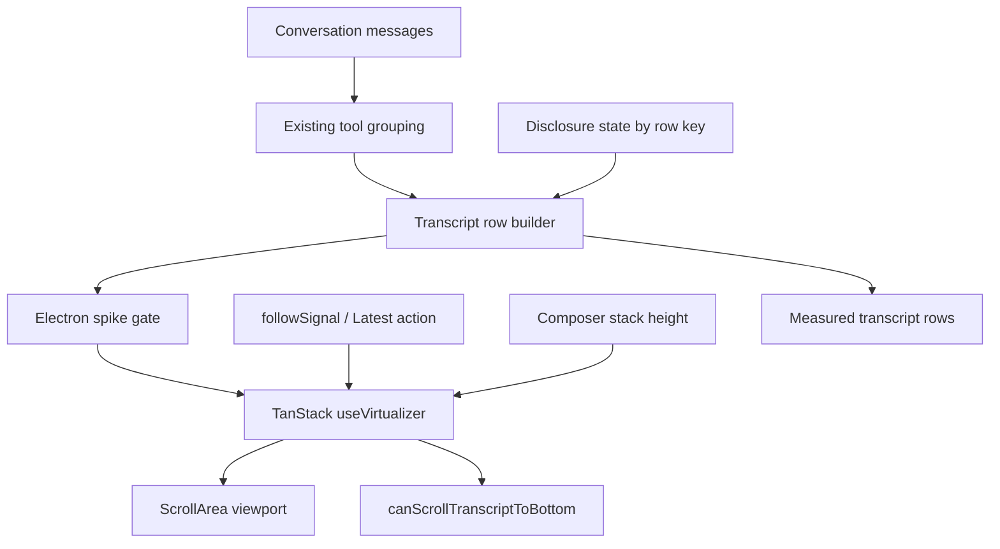

# feat: Virtualize transcript panel with TanStack Virtual

## Summary

Adopt TanStack Virtual's chat-oriented end anchoring for the transcript panel behind a contained implementation spike. The work should preserve the current transcript experience while replacing the hand-rolled bottom-follow logic with a measured, virtualized row list that can handle long threads and streaming growth more reliably.

---

## Problem Frame

The transcript currently renders every grouped message and manually tracks whether the user is pinned to the bottom with viewport `scrollHeight` math in `src/components/transcript.tsx`. That is workable for short threads, but it makes long sessions expensive, requires custom follow logic for streaming updates, and will become more brittle if older-history prepends or richer transcript rows arrive later.

TanStack Virtual's latest chat guidance is directly aimed at this contract: normal chronological order, stable keys, dynamic measurement, `anchorTo: "end"`, `followOnAppend`, and `isAtEnd()` for "jump to latest" UI. The plan treats adoption as a bounded change to the transcript panel, not a redesign of message rendering or the backend thread model.

---

## Requirements

**Transcript Behavior**

- R1. The transcript renders the same semantic rows users see today: thread review-change rows, turn review-change rows, grouped tool activity, individual tool entries, phase messages, assistant prose, user messages, and the working indicator.
- R2. When the user is already at the latest output, appended messages and streaming growth keep the viewport pinned to the bottom without manual `scrollHeight` compensation.
- R3. When the user scrolls away from the latest output, new appended output does not pull the reader back down until they explicitly choose to jump.
- R4. The existing "scroll to bottom" composer affordance appears only when the transcript is not at the latest output and scrolls to the end when used.
- R5. Composer overlay spacing remains correct so the final transcript row is not hidden behind wait cards, errors, or the composer stack.

**State and Interaction**

- R6. Stable row keys identify transcript content across message grouping, tool grouping, working-indicator changes, and thread/turn review-change count updates.
- R7. Expanded tool/detail disclosures remain stable across virtualized unmount/remount for rows where the user has interacted.
- R8. Existing tool disclosure animation and reduced-motion behavior remain coherent after virtualized row wrapping.
- R9. Transcript search, selection/copy, keyboard, live-region, and screen-reader workflows are explicitly checked before deciding to keep virtualization.

**Dependency and Safety**

- R10. Add `@tanstack/react-virtual` without bypassing `minimumReleaseAge`; use a version that satisfies the repository's pnpm supply-chain policy.
- R11. Keep the change localized to the desktop renderer transcript surface; do not change the Roder app-server thread API or message derivation model.
- R12. Provide automated coverage for deterministic row/key/state contracts, and verify real scroll/measurement behavior in the Electron app shell.

---

## Key Technical Decisions

- **Use TanStack Virtual chat mode, not a custom virtualizer:** The library now exposes the exact contract this panel needs: `anchorTo: "end"` for stable chat anchoring, `followOnAppend` for pinned-only appends, `scrollToEnd()` for the latest button, and `isAtEnd()` for composer state. This replaces the bespoke bottom math in `src/components/transcript.tsx` with an upstream-maintained scroll model.
- **Keep normal chronological row order:** The plan follows TanStack's recommended pattern and avoids `flex-direction: column-reverse`, inverted transforms, or manual prepend compensation. Normal order matches the current data flow from `messagesFromThread` through `groupToolMessagesForTranscript` and keeps accessibility/read order predictable.
- **Introduce a small transcript row model before rendering:** A focused row-builder gives the virtualizer stable keys for non-message rows such as thread review-change rows, turn review-change rows, and the working indicator. This is not a new transcript architecture; it is a testable adapter between existing grouped entries and virtualized rendering.
- **Use `paddingEnd` for composer clearance:** The existing `bottomInsetPx` maps naturally to virtualizer end padding. This keeps the overlay design in `src/pages/chat/chat-page.tsx` while making the inset part of the measured scroll range rather than a padding style on a flex column.
- **Control disclosure state for virtualized rows:** Current Base UI collapsibles are effectively local to mounted rows. Virtualization can unmount offscreen rows, so disclosure state should be keyed by stable transcript row IDs and passed down through Base UI's controlled `open` and `onOpenChange` props.
- **Do not add a browser-DOM test dependency just to assert real scrolling:** The existing Vitest setup runs in Node and real scroll measurement is the risky behavior. Automated tests should cover deterministic row/state contracts; final scroll validation belongs in the Electron shell where preload APIs, layout, and ResizeObserver behavior match production.
- **Pin dependency adoption to policy-compliant current release:** As of 2026-05-30, `@tanstack/react-virtual` latest is `3.13.26`, published 2026-05-25, and depends on `@tanstack/virtual-core` `3.16.0`. That version satisfies the repo's 1-day `minimumReleaseAge`; implementation should not use override flags or policy exceptions.
- **Gate the adoption on measured value, not novelty:** The implementation can add the dependency in the working branch to run the spike, but keeping it should depend on Electron-shell evidence that it improves long-thread DOM count and responsiveness without unacceptable search/copy/accessibility regressions.
- **Separate follow intent from visual affordance state:** Use a forgiving virtualizer `scrollEndThreshold` for streaming follow behavior, but keep the composer fade/button threshold tight so the bottom mask does not disappear while content is still passing behind the fixed composer.

---

## Alternative Approaches Considered

| Approach | Strength | Weakness | Plan Decision |
|---|---|---|---|
| Keep full render and memoize rows | Lowest dependency and compatibility risk; native find/copy remain intact | Does not reduce total DOM nodes and leaves custom bottom-follow logic in place | Use as the baseline for the spike; keep if virtualization does not clearly improve the problem |
| TanStack Virtual chat mode | Direct support for end anchoring, pinned append following, dynamic measurement, and stable keyed prepends | Recent chat APIs and virtualized DOM can affect find/copy/accessibility workflows | Primary candidate because it matches the transcript scroll contract |
| Dedicated chat/message-list library | May include more chat-specific batteries | Larger migration surface and more visual/opinionated behavior to reconcile with existing transcript rows | Defer unless TanStack fails the spike but virtualization remains necessary |
| Small custom windowing layer | Full local control and no new runtime dependency | Recreates hard scroll/measurement edge cases the library is designed to own | Reject for this spike unless the dependency proves incompatible |

---

## High-Level Technical Design

The data flow stays one-way: messages are grouped as they are today, converted into stable transcript rows, and rendered only for the virtualizer's visible range. Scroll intent flows through the virtualizer instance instead of direct viewport height math. User-driven disclosure state lives outside individual row mounts so virtualized unmounting does not erase it.

---

## Scope Boundaries

### In Scope

- Virtualize the transcript panel used by the main chat route.
- Preserve the current transcript row types, styling language, and composer overlay behavior.
- Add the TanStack Virtual React adapter dependency in the working branch to run the spike; keep it in the final change only if the Electron spike gate passes.
- Add targeted unit tests for row construction, stable keys, disclosure state, and any pure scroll-state adapters introduced by the implementation.

### Deferred to Follow-Up Work

- Older-history lazy loading or prepend pagination. Compatibility here means stable non-index row keys, normal chronological order, and no inverted layout; it does not include implementing or validating prepend loading, prepend scroll preservation, or backend pagination.
- Scroll position persistence across app restarts or route history restoration.
- A general-purpose virtualization abstraction shared with the review diff panel.
- Reworking markdown rendering, tool grouping rules, or thread-item derivation.

### Out of Scope

- Roder app-server API changes.
- Replacing Base UI collapsibles or rewriting tool row components for a new visual design.
- Adding browser automation against the Vite renderer as the final UI proof; this project requires Electron-shell validation for desktop UI.

---

## Acceptance Examples

- AE1. Given the transcript is at the latest output, when an assistant message streams additional text chunks, then the bottom of the viewport remains pinned to the growing message and the composer "scroll to bottom" affordance stays hidden.
- AE2. Given the user scrolls upward to read prior output, when a new assistant/tool/working row appears, then the viewport remains on the history the user was reading and the composer affordance remains visible.
- AE3. Given the composer affordance is visible, when the user invokes it, then the transcript scrolls to the latest row and the affordance hides after the virtualizer reports the viewport is at the end.
- AE4. Given a user expands a tool activity group, scrolls far enough that the row is virtualized away, and scrolls back, then the disclosure state remains as the user left it.
- AE5. Given wait cards, an error line, or a resized composer increase the bottom overlay height, when the transcript is at the latest output, then the latest row remains visible above the overlay with the same visual clearance as today.
- AE6. Given a long mixed transcript, when the user uses find, selects/copies visible text, navigates disclosures by keyboard, or relies on the working indicator announcement, then virtualization does not degrade the workflow beyond the explicitly accepted spike tradeoff.

---

## Implementation Units

### U1. Add Policy-Compliant TanStack Virtual Dependency

- **Goal:** Add the React virtualizer package needed by the transcript component while honoring repository dependency policy.
- **Requirements:** R10, R11
- **Dependencies:** None
- **Files:** `package.json`, `pnpm-lock.yaml`
- **Approach:** Add `@tanstack/react-virtual` as a runtime dependency in the implementation branch using the normal pnpm policy. Do not bypass `minimumReleaseAge` or add package-manager exceptions. Prefer the current policy-compliant release; as of planning, `3.13.26` is latest and old enough for this repo's policy. If the spike gate fails, the rollback includes removing this package and lockfile entry.
- **Patterns to follow:** Existing dependency declarations in `package.json`; pnpm workspace policy in `pnpm-workspace.yaml`.
- **Test scenarios:** Test expectation: none -- dependency metadata is verified through install state, lockfile consistency, and typecheck rather than a behavioral test.
- **Verification:** The dependency resolves through the lockfile without policy overrides, no unrelated package churn is introduced, and TypeScript can import the React adapter.

### U2. Build Stable Transcript Row Contract

- **Goal:** Convert existing grouped transcript entries into a stable row list suitable for virtualization and testing.
- **Requirements:** R1, R6, R12
- **Dependencies:** None
- **Files:** `src/lib/transcript-rows.ts`, `src/components/transcript.tsx`, `test/transcript-rows.test.ts`
- **Approach:** Keep `groupToolMessagesForTranscript` as the source of grouped content. Add a narrow row-builder that interleaves thread review-change rows, message/tool/activity rows, turn review-change rows, and the working indicator with stable keys. Keys should be based on persistent message IDs, group IDs, turn IDs, or fixed synthetic row IDs for singleton controls, not array indexes.
- **Execution note:** Implement the row-builder test-first because stable keys are the main safety contract for end anchoring.
- **Patterns to follow:** Stable group IDs in `src/lib/tool-message-groups.ts`; message identity from `src/lib/roder-thread.ts`; current rendering branches in `src/components/transcript.tsx`.
- **Test scenarios:**
  - Given adjacent tool messages that collapse into an activity group, building rows produces one activity row with a stable activity-group key.
  - Given a thread-level review-change count, building rows places a thread review-change row before transcript message rows and preserves its key when the count changes.
  - Given turn review-change counts for two turns, building rows places each turn review-change row at the same boundary currently selected by `findTurnBoundaryIndexes`.
  - Given `showWorkingIndicator` toggles on and off, building rows appends/removes only the working row and does not change existing message row keys.
  - Given an empty message list with only the working indicator, building rows still produces a stable working row.
- **Verification:** Existing transcript grouping tests continue to pass, new row tests prove stable ordering/keys, and the component can render from rows without changing visible content.

### U6. Prove Electron Fit Before Full Adoption

- **Goal:** Establish that TanStack Virtual is worth keeping before replacing the full transcript path.
- **Requirements:** R2, R3, R4, R5, R9, R10, R11, R12; covers AE1, AE2, AE3, AE5, AE6
- **Dependencies:** U1, U2
- **Files:** `src/components/transcript.tsx`, `src/pages/chat/chat-page.tsx`, `docs/plans/2026-05-30-002-feat-virtualized-transcript-panel-plan.md`
- **Approach:** Build the smallest Electron-validatable spike that proves end anchoring, dynamic row measurement, composer inset handling, and long-thread value. Compare against the current full-render transcript on a representative mixed long thread and a lighter "do nothing or memoize" baseline. Keep the current manual-scroll path available until this gate passes.
- **Patterns to follow:** Existing transcript behavior in `src/components/transcript.tsx`; desktop validation guidance in `AGENTS.md`; TanStack chat guide's normal-order, stable-key, measured-row pattern.
- **Test scenarios:**
  - Covers AE1. In a long mixed transcript while pinned, stream text into the final assistant row and confirm resize-without-append stays within the latest threshold without button flicker.
  - Covers AE2. While scrolled up, append rows and resize an existing offscreen/nearby row; confirm the reader's visible context is preserved.
  - Covers AE5. Resize the composer and show wait/error overlays while pinned; confirm the latest row remains visible above the overlay.
  - Covers AE6. Check native find behavior, visible text selection/copy, disclosure keyboard operation, working indicator announcement, and focus after invoking latest.
  - Compare current full render, a lighter memoization/no-virtualization baseline if practical, and the virtualized spike for DOM node count, append/stream responsiveness, scroll jank, and memory behavior.
- **Verification:** The gate passes only if the virtualized path shows clear long-thread value and no unacceptable compatibility regression. If it fails, stop the adoption path, remove the dependency/lockfile entry, restore the manual-scroll transcript path, and decide separately whether the row-builder tests are worth keeping.

### U3. Replace Manual Bottom Math With End-Anchored Virtualizer

- **Goal:** Render transcript rows through TanStack Virtual and move follow/latest state onto the virtualizer API.
- **Requirements:** R2, R3, R4, R5, R9, R11, R12; covers AE1, AE2, AE3, AE5, AE6
- **Dependencies:** U1, U2, U6
- **Files:** `src/components/transcript.tsx`, `test/transcript-scroll-intent.test.ts`
- **Approach:** Use the existing `ScrollArea` viewport as the virtualizer scroll element; it already exposes the needed viewport ref and scroll callback. Configure the virtualizer with stable row keys, dynamic measurement, end anchoring, pinned-only append following, a forgiving follow threshold, a tighter composer-affordance threshold, overscan, and `paddingEnd` from `bottomInsetPx`. Replace direct `viewport.scrollTo({ top: viewport.scrollHeight })` calls with `scrollToEnd()`, and derive `onCanScrollToBottomChange` from `isAtEnd()` rather than raw scroll math. Keep `followSignal` as the imperative "latest" trigger from the app shell.
- **Technical design:** Directional guidance: render an outer total-size spacer, absolutely position measured row wrappers by virtual item start, and put each current transcript row body inside that wrapper. The row wrapper should own vertical padding/spacing so measurements include the intended visual gap.
- **Patterns to follow:** Current `ScrollArea` viewport ref pattern in `src/components/ui/scroll-area.tsx`; composer follow signal in `src/hooks/use-app-shell-controller.ts`; TanStack Virtual chat example using `anchorTo: "end"`, `followOnAppend`, `measureElement`, and `scrollToEnd()`.
- **Test scenarios:**
  - Covers AE3. Given the parent triggers a follow signal, the transcript invokes the virtualizer's scroll-to-end path and reports that the latest affordance should hide once at-end state is true.
  - Given `bottomInsetPx` changes while at the latest output, the virtualizer end padding updates and the latest row remains part of the scroll range.
  - Given rows re-render with the same stable keys, the virtualized render path does not fall back to index keys.
  - Given the user is not at the end, the transcript reports `canScrollToBottom` as true without calling an imperative follow.
  - Given a smooth latest scroll is interrupted by user scrolling, the user's scroll intent wins and the latest affordance state follows the virtualizer's next at-end reading.
  - Given item height changes without an append, the contract distinguishes pinned-latest behavior from reading-history behavior.
  - Test expectation for actual pixel-perfect scroll anchoring: manual Electron validation -- jsdom-style tests do not reliably prove ResizeObserver and scroll measurement behavior.
- **Verification:** Long transcripts render only visible rows plus overscan, latest/follow behavior matches current UX, and no Vite-browser-only validation is treated as authoritative.

### U4. Preserve Tool Disclosure State and Motion Under Virtualization

- **Goal:** Keep expandable tool/activity rows usable when rows unmount and remount.
- **Requirements:** R1, R7, R8, R12; covers AE4
- **Dependencies:** U2, U3
- **Files:** `src/components/transcript.tsx`, `src/components/tool-activity-group.tsx`, `src/components/compact-tool-group.tsx`, `src/components/tool-shell-item.tsx`, `src/style.css`, `test/transcript-disclosure-state.test.ts`
- **Approach:** Add a small disclosure-state map keyed by the disclosure key emitted by the transcript row builder, and pass controlled open/change props to collapsible tool components. Base UI's Collapsible root already supports this controlled contract, so the change can stay inside local wrappers rather than replacing the primitive. Default state should match today's collapsed behavior; pruning should remove keys whose owning row no longer exists. Keep the current `tool-disclosure-panel` animation. Ensure virtualized row wrappers use padding or contained spacing rather than external margins that can escape measurement.
- **Execution note:** Add reducer/helper tests before wiring the controlled props so row identity behavior is locked down.
- **Patterns to follow:** Base UI `Collapsible` usage in the existing tool components; reduced-motion handling for `.tool-disclosure-panel` in `src/style.css`; design guidance for short, purposeful visibility motion in `docs/design.md`.
- **Test scenarios:**
  - Covers AE4. Given a disclosure key is toggled open, removing and re-adding that key to the visible row set preserves the open state.
  - Given a disclosure key disappears because its message/group is no longer present, stale state is pruned without affecting other keys.
  - Given multiple disclosure rows are toggled independently, changing one row does not change another row's state.
  - Given reduced-motion preference is active, disclosure panel transitions remain disabled as they are today.
- **Verification:** Tool groups can expand/collapse before and after scrolling away, measurements update when a disclosure opens/closes, and existing visual motion remains consistent.

### U5. Electron-Shell Validation and Fallback Criteria

- **Goal:** Prove the spike is safe to land, and define when to revert to the current non-virtualized transcript approach.
- **Requirements:** R2, R3, R4, R5, R7, R8, R9, R12; covers AE1, AE2, AE3, AE4, AE5, AE6
- **Dependencies:** U3, U4
- **Files:** `src/components/transcript.tsx`, `src/pages/chat/chat-page.tsx`, `docs/plans/2026-05-30-002-feat-virtualized-transcript-panel-plan.md`
- **Approach:** Validate in the running Electron app with a representative mixed long-thread fixture and, when available, real thread data. Exercise pinned streaming, scrolled-up append, latest jump, bottom overlay resizing, disclosure remounts, search/copy/accessibility workflows, and long-thread performance. Keep rollback criteria explicit: revert the virtualized transcript if end anchoring jitters under streaming, bottom inset cannot be made reliable, accessibility/search/copy regressions are unacceptable, or controlled disclosures create unacceptable complexity.
- **Patterns to follow:** Project guidance in `AGENTS.md` that desktop UI verification must happen in the desktop shell, not plain browser automation against the Vite renderer.
- **Test scenarios:**
  - Covers AE1. While pinned to the latest output, stream a long assistant response and confirm the viewport remains stuck to the bottom with no visible drift.
  - Covers AE2. Scroll to older output, append new tool and assistant rows, and confirm the viewport does not move until the user chooses latest.
  - Covers AE3. Use the composer latest affordance and confirm it scrolls to the newest row and then hides.
  - Covers AE4. Expand a tool activity group, scroll far away and back, and confirm it remains expanded.
  - Covers AE5. Trigger wait cards and composer height changes and confirm the final row remains visible above the overlay.
  - Covers AE6. Check native find behavior, visible text selection/copy, disclosure keyboard operation, focus behavior after latest, and the working indicator's live announcement.
  - With a long transcript, confirm row count in the DOM remains bounded by visible range plus overscan rather than total message count.
  - Run the same validation at a compact window size and a full-size desktop window so overlay spacing and latest-button behavior are not only checked in one layout.
- **Verification:** Manual Electron validation confirms the acceptance examples, automated deterministic tests pass, typecheck/lint/build remain clean, and fallback criteria are not triggered. If any fallback criterion is triggered, stop landing the virtualized path and document the blocker instead of treating it as an acceptable known issue.

---

## System-Wide Impact

- **Renderer performance:** The transcript should render fewer DOM nodes for long threads. Markdown and tool rows remain expensive individually, so overscan should be conservative enough to avoid blanking while scrolling without recreating the old full-render cost.
- **Scroll ownership:** The transcript becomes dependent on TanStack Virtual for at-end state and follow behavior. App shell state remains the owner of whether the composer button is visible, but the transcript reports that state through virtualizer APIs.
- **User intent preservation:** Scroll position is valuable state in this app. The virtualizer must not steal position when the user is reading history, and follow behavior should remain tied to explicit send/select/latest actions or already-pinned output.
- **Transcript compatibility:** Virtualization reduces DOM nodes by design, which may affect native find-in-page, full transcript selection/copy, and assistive technology access to offscreen content. The spike must make that tradeoff explicit before landing.
- **Desktop validation:** Real confidence depends on Electron layout, preload-dependent renderer behavior, ResizeObserver, and the actual composer overlay, so browser-only checks are insufficient.

---

## Risks & Dependencies

- **New chat APIs are recent:** `anchorTo`, `followOnAppend`, and related chat guidance are newly documented. Mitigation: keep adoption localized, pin a policy-compliant release, and define rollback criteria before removing the old behavior completely.
- **Dynamic measurement can drift with animated disclosures:** Tool disclosure panels change height during animation. Mitigation: ensure measured row wrappers receive `measureElement`, keep animation short/reduced-motion-aware, and manually validate expansion while pinned and while reading history.
- **Index-key regressions would break prepend stability later:** Even though prepend loading is deferred, using row indexes would make future older-history work harder. Mitigation: make stable keys a first-class row-builder test.
- **Manual validation may miss rare thread shapes:** The transcript has multiple row families. Mitigation: use deterministic row tests for edge shapes and validate with a long mixed transcript containing user, assistant, phase, tool, grouped activity, review-change, working, and error states.
- **Dependency policy can block too-new releases:** The repo enforces `minimumReleaseAge: 1440`. Mitigation: use only a release old enough for the policy and never override the package manager protections.
- **Virtualized DOM may remove implicit full-transcript affordances:** Native find/copy/accessibility behavior may change when offscreen rows are not mounted. Mitigation: validate those workflows in the spike and treat unacceptable regression as a rollback criterion or as a prompt for a separate search/export/accessibility design.

---

## Sources & Research

- `src/components/transcript.tsx` currently owns manual pinned-bottom state, message-version tracking, transcript grouping, and row rendering.
- `src/pages/chat/chat-page.tsx` owns composer overlay height, bottom inset, and the composer "scroll to bottom" affordance.
- `src/hooks/use-app-shell-controller.ts` owns the `followSignal` mechanism used by thread selection, sending prompts, and explicit latest actions.
- `src/lib/tool-message-groups.ts` already provides stable group IDs that can feed virtualized row keys.
- `src/components/tool-activity-group.tsx`, `src/components/compact-tool-group.tsx`, and `src/components/tool-shell-item.tsx` use Base UI collapsibles that need controlled state when virtualized.
- `node_modules/@base-ui/react/collapsible/root/CollapsibleRoot.d.ts` confirms Collapsible root supports controlled `open` and `onOpenChange` props.
- `docs/design.md` emphasizes preserving user intent, readable transcript content, and short purposeful visibility motion.
- TanStack Virtual Chat guide: `https://tanstack.com/virtual/latest/docs/chat`
- TanStack Virtual React chat example: `https://tanstack.com/virtual/latest/docs/framework/react/examples/chat`
- TanStack Virtual API reference: `https://tanstack.com/virtual/latest/docs/api/virtualizer`
- TanStack Virtual installation docs: `https://tanstack.com/virtual/latest/docs/installation`
