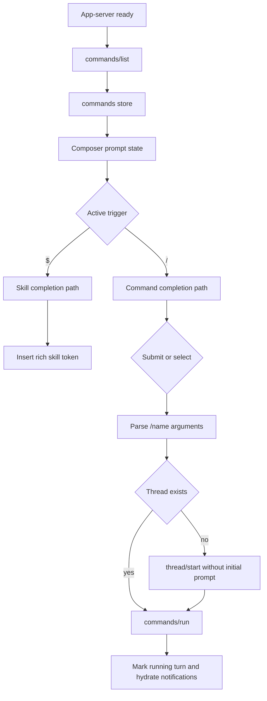

# feat: Add slash command composer

## Summary

Add a slash-first command system to desktop: typing `/` in the composer discovers app-server command descriptors, selecting or submitting a known command runs it through the command API, and normal prompts plus `$skill` tokens continue to behave as they do today. The first pass deliberately stops short of a full global command palette, but it creates shared completion primitives that a future palette can reuse.

---

## Problem Frame

The desktop composer already has a polished skills flow: `$` detects a token, ranks matching skills, shows an accessible listbox, inserts a completion, and renders known skills as rich Lexical tokens. The TUI has a parallel slash-command flow backed by `commands/list` and `commands/expand`, plus descriptor-level warnings for commands that change model/agent behavior or include shell/URL context. Desktop currently lacks that command surface, which leaves workspace, user, and plugin commands discoverable in TUI but not in desktop.

The implementation should reuse the parts of the skills system that are actually generic: active-token detection, menu highlight/dismissal behavior, listbox shell, keyboard handling, and pure command matching. It should not collapse skills and commands into one semantic model. Skills insert prompt tokens; commands invoke actions at the submission boundary.

---

## Requirements

**Command discovery and completion**

- R1. Desktop loads the app-server command catalog via `commands/list` when the app-server is ready, caches it for composer use, and handles unavailable older app-server builds without breaking normal chat.
- R2. Typing a slash query at the start of the prompt shows command completions only while the query is command-shaped: single-line, no attachments, not `//`, and before command arguments are being typed.
- R3. Command completions show the command name, argument hint, description, source, and warning state when the descriptor indicates model, agent, shell include, URL include, or extension-origin behavior.
- R4. Keyboard and pointer interaction mirrors the existing skill completion ergonomics: arrow navigation wraps, tab completes, enter runs the selected or exact command, escape dismisses, and focus returns to the editor after selection.

**Command invocation**

- R5. Submitting a known slash command invokes command handling instead of sending the literal `/name args` as a normal user prompt.
- R6. App-server-backed commands run through `commands/run` against the active thread, creating a thread first when the composer is on the new-thread route.
- R7. Command invocations pass the selected workspace path when desktop can resolve one, so command expansion uses the same project root the user sees in the desktop chrome.
- R8. Command failures surface through the existing agent error path, leave thread state consistent, and do not mark stale active turns as running.

**Compatibility and scope**

- R9. Existing normal prompt submission, attachments, voice dictation, paste/drop attachments, `$skill` completion, and rich skill-token rendering remain behaviorally unchanged.
- R10. The first implementation includes a reusable command/action model that can feed a later global palette, but it does not ship the full multi-source palette launcher.

---

## Key Technical Decisions

- KTD1. **Slash commands are actions, not prompt tokens:** Skills belong inside the prompt text and therefore keep their rich Lexical token rendering. Slash commands are detected in the composer but execute at the submission boundary, because they may start turns, create threads, or later route to desktop-native actions.
- KTD2. **Extract reusable completion mechanics below skill semantics:** Move common highlight state, dismissal state, listbox behavior, and index movement into generic composer-completion utilities. Keep skill-specific token parsing/rendering in the skill modules and command-specific invocation parsing in command modules.
- KTD3. **Use `commands/run` for command execution:** `commands/run` is the app-server contract that expands and starts a command-backed turn. Desktop should create a thread first when necessary, then call `commands/run`, instead of approximating command behavior by sending expanded text through `turn/start`.
- KTD4. **Warn from descriptor metadata in the MVP:** The completion UI should surface descriptor warnings before execution. A full expanded-preview panel can come later; descriptor warnings catch the important early risk signals without blocking the slash-first scope.
- KTD5. **Defer full local TUI built-ins:** This plan builds the command substrate and app-server command execution. Desktop-native equivalents for `/goal`, `/tasks`, `/ps`, `/workflows`, and a global command palette belong in follow-up units once the shared command/action model is in place.

---

## High-Level Technical Design

The shared layer is the completion control surface, not the semantic payload. Skills and commands both feed listbox entries and keyboard behavior, but only skills rewrite prompt tokens; commands cross into the thread/turn command execution path.

---

## Scope Boundaries

### In Scope

- Slash command catalog loading, matching, warning display, completion, and execution.
- Reusable completion primitives extracted from the skills implementation where the behavior is identical.
- Store and IPC wrappers for `commands/list` and `commands/run`, including types for the expanded command metadata returned by `commands/run`.
- Tests for pure command parsing/matching, IPC params, command store loading, composer completion behavior, and store-level command execution.

### Deferred to Follow-Up Work

- Full global command palette spanning threads, commands, models, settings, runners, skills, processes, and plugins.
- Desktop-native implementations of TUI local commands such as goal editing, process monitor commands, task monitor commands, workflow controls, roadmap mode, and Webwright commands.
- Direct `commands/expand` preview UI that displays expanded message, context blocks, allowed tools, and model/agent overrides before run.
- Command history, recent commands, and fuzzy ranking across multiple palette sources.

---

## Implementation Units

### U1. Command Protocol Types and IPC

- **Goal:** Add typed desktop access to the app-server command methods.
- **Requirements:** R1, R6, R7, R8
- **Dependencies:** None
- **Files:** `src/types/roder.ts`, `src/lib/roder-ipc.ts`, `test/roder-ipc-commands.test.ts`
- **Approach:** Define `CommandDescriptor`, command list/run result types, and minimal context-block/expanded-command types needed for the `commands/run` response. Add `roderIpc.listCommands` and `roderIpc.runCommand` wrappers using the serialized params expected by the app-server protocol. Include a workspace string in run params when provided.
- **Patterns to follow:** `src/lib/roder-ipc.ts` skills wrappers and `test/roder-ipc-skills.test.ts`; review IPC tests in `test/roder-ipc-review.test.ts`.
- **Test scenarios:**
  - Calling `listCommands` sends `commands/list` with `{}` and returns the command array.
  - Calling `runCommand` sends `commands/run` with `thread_id`, `name`, `arguments`, and `workspace` when present.
  - Missing optional workspace does not serialize as an incorrect empty path.
- **Verification:** IPC tests prove method names and params match `docs/api.md`.

### U2. Command Catalog Store

- **Goal:** Keep command descriptors available to the composer without coupling catalog loading to composer rendering.
- **Requirements:** R1, R3
- **Dependencies:** U1
- **Files:** `src/stores/commands-store.ts`, `src/pages/chat/chat-page.tsx`, `test/commands-store.test.ts`
- **Approach:** Mirror the skills store shape: `commands`, `loaded`, `loading`, `error`, and `load`. Load only when the app-server is ready. Treat missing command methods as a non-fatal empty catalog so normal chat continues on older bundled binaries.
- **Patterns to follow:** `src/stores/skills-store.ts` and the loading effect in `src/pages/chat/chat-page.tsx`.
- **Test scenarios:**
  - Successful load stores sorted command descriptors and clears prior errors.
  - Concurrent load calls coalesce or leave stable state without duplicate user-visible errors.
  - A rejected `commands/list` call records an error and leaves `commands` as an empty list.
  - Reload after a failure can replace the empty catalog with commands.
- **Verification:** Store tests cover ready-state loading and failure tolerance.

### U3. Reusable Composer Completion Primitives

- **Goal:** Extract the shared menu-state and listbox mechanics currently embedded in the skills completion flow.
- **Requirements:** R4, R9
- **Dependencies:** None
- **Files:** `src/lib/composer-completions.ts`, `src/hooks/use-composer-completion.ts`, `src/components/composer-completion-popup.tsx`, `src/hooks/use-skill-completion.ts`, `src/components/skill-completion-popup.tsx`, `test/composer-completions.test.ts`, `test/roder-skills.test.ts`
- **Approach:** Introduce generic helpers for completion keying, dismissal, wraparound movement, and active-option IDs. Introduce a reusable popup shell that accepts generic entries and a renderer callback. Refactor `useSkillCompletion` and `SkillCompletionPopup` to use the shared primitives while preserving the existing skill API and DOM affordances.
- **Execution note:** Characterize the current skills behavior first, then refactor to the shared primitives.
- **Patterns to follow:** Current `src/hooks/use-skill-completion.ts`, `src/components/skill-completion-popup.tsx`, and `test/roder-skills.test.ts`.
- **Test scenarios:**
  - Generic index movement wraps next and previous exactly like current skill completion.
  - Dismissal hides only the current token completion key and resets when the query changes.
  - The refactored skill completion still excludes disabled skills, ranks matches the same way, inserts `$skill` with spacing, and restores editor focus.
  - The reusable popup preserves `role="listbox"`, `role="option"`, active option ID generation, mouse highlight, and mouse-down focus protection.
- **Verification:** Existing skill tests remain green, and new generic completion tests cover the extracted behavior.

### U4. Command Parsing, Matching, and Warning Utilities

- **Goal:** Add pure command utilities equivalent to the TUI slash-command behavior, adapted for desktop naming and tests.
- **Requirements:** R2, R3, R5
- **Dependencies:** U1, U3
- **Files:** `src/lib/roder-commands.ts`, `test/roder-commands.test.ts`
- **Approach:** Implement slash-query detection, command matching, accepted completion text, selected invocation, exact invocation parsing, and descriptor warning labels. Keep this pure and independent of React/Lexical so it is reusable by both composer completion and a future global palette.
- **Patterns to follow:** `src/lib/roder-skills.ts` for pure utility style and TUI slash-command behavior described in prior research.
- **Test scenarios:**
  - `/re` matches commands by prefix and sorts predictably.
  - `//comment`, filesystem-style slash paths, mid-prompt slash text, and multi-line slash text do not produce runnable command invocations.
  - `/review api` parses as command `review` with arguments `api` only when `review` exists in the catalog.
  - Tab completion returns `/name ` and preserves a single trailing space.
  - Warnings return labels for agent, model, shell include, URL include, and extension-origin descriptors.
- **Verification:** Pure utility tests cover command-shaped and non-command-shaped boundaries before React integration begins.

### U5. Slash Completion in the Composer

- **Goal:** Show and operate `/` command completions alongside existing `$` skill completions.
- **Requirements:** R2, R3, R4, R9
- **Dependencies:** U2, U3, U4
- **Files:** `src/hooks/use-command-completion.ts`, `src/components/command-completion-popup.tsx`, `src/components/composer.tsx`, `src/pages/chat/chat-page.tsx`, `test/command-completion.test.ts`, `test/composer-command-completion.test.tsx`
- **Approach:** Add a command-completion hook that uses the shared completion primitives and pure command utilities. Wire the composer to receive command descriptors, render a command popup when `/` is active, and prioritize whichever trigger is active at the caret. Keep command completion hidden when attachments are present. Preserve the current skill completion path for `$`.
- **Patterns to follow:** `src/hooks/use-skill-completion.ts`, `src/components/skill-completion-popup.tsx`, and `src/components/composer.tsx`.
- **Test scenarios:**
  - Typing `/re` shows matching command rows with name, hint, description, and warnings.
  - Arrow keys move the highlighted command; tab completes the command name into the editor; escape dismisses until the query changes.
  - Enter on a selected command invokes the command submit path rather than plain prompt submit.
  - `$` skill completion still appears and behaves normally after command completion is added.
  - Command completion is hidden when attachments exist or the slash query contains whitespace.
- **Verification:** Hook/component tests prove completion behavior without requiring Electron visual verification.

### U6. Command Execution Boundary

- **Goal:** Run selected slash commands through the command API while preserving existing thread and turn state behavior.
- **Requirements:** R5, R6, R7, R8, R9
- **Dependencies:** U1, U2, U4, U5
- **Files:** `src/stores/roder-store.ts`, `src/hooks/use-roder-agent.ts`, `src/hooks/use-app-shell-controller.ts`, `src/components/app-shell-context.tsx`, `src/components/composer.tsx`, `test/roder-store-commands.test.ts`
- **Approach:** Add a store-level command execution action that ensures a thread exists, marks the thread running, calls `commands/run`, and records the returned turn ID. Let the app shell decide whether a submitted composer value is a known slash command or a normal prompt, because the shell has access to command catalog state, selected workspace path, active thread state, and follow-bottom behavior.
- **Technical design:** Directional shape only: normal prompt submissions continue through `sendPrompt`; command submissions call `runCommandInvocation`. If no thread exists, create a thread with the selected workspace and no initial prompt, then call `commands/run` for that new thread.
- **Patterns to follow:** `sendPrompt`, `startThreadForSelection`, and existing running-turn status updates in `src/stores/roder-store.ts`; workspace selection helpers in `src/lib/roder-workspaces.ts`.
- **Test scenarios:**
  - Existing idle thread plus `/review api` calls `commands/run` with the active thread ID and selected workspace path.
  - New-thread route plus `/review api` first creates or resolves a workspace/thread, then calls `commands/run` with the new thread ID.
  - A running active thread blocks command execution the same way normal prompt submission is blocked.
  - A failed `commands/run` clears busy state, restores idle status for any optimistically marked thread, and surfaces the error.
  - A normal prompt beginning with an unknown slash-like path is still sent through `turn/start`.
  - Attachments plus slash-looking text go through the normal prompt path rather than command execution.
- **Verification:** Store tests cover command execution state transitions and prove normal prompt submission is unchanged.

### U7. User-Facing Error and Warning Polish

- **Goal:** Make slash-command behavior understandable without adding a full preview panel.
- **Requirements:** R3, R8, R10
- **Dependencies:** U5, U6
- **Files:** `src/components/command-completion-popup.tsx`, `src/components/composer.tsx`, `src/stores/roder-store.ts`, `test/command-completion.test.ts`, `test/roder-store-commands.test.ts`
- **Approach:** Surface descriptor warnings as compact labels in the command completion rows. Surface command load failures quietly unless the user is actively trying to use slash commands. Reuse existing agent error rendering for run failures.
- **Patterns to follow:** Error handling in `src/stores/skills-store.ts`, the existing composer popup styling, and agent error display in `src/pages/chat/chat-page.tsx`.
- **Test scenarios:**
  - Warning labels render for command descriptors with model, agent, shell include, URL include, and extension source metadata.
  - Command catalog load failure does not block ordinary prompt submission.
  - Running an unknown or disabled command reports the app-server error through the existing error state.
- **Verification:** Component and store tests cover warning visibility and non-fatal failure handling.

---

## Acceptance Examples

- AE1. Given the command catalog contains `review`, when the user types `/re`, the composer shows `/review`; pressing tab replaces the query with `/review ` and leaves the editor focused.
- AE2. Given the command catalog contains `review`, when the user submits `/review api` on an idle thread, desktop calls the command run API with `name: "review"` and `arguments: "api"` instead of sending `/review api` as a normal user message.
- AE3. Given the user is composing `Use $ai`, when skills are loaded, the `$` skill menu and rich skill-token behavior remain unchanged.
- AE4. Given an app-server build without command methods, when the user sends a normal prompt, chat still works and no command UI blocks the composer.
- AE5. Given a command descriptor uses shell includes, when it appears in completion, the row includes a warning label before the user runs it.

---

## System-Wide Impact

This change crosses the composer, app shell, Zustand store, and app-server IPC boundary. It should not alter Electron preload APIs because renderer code already calls app-server methods through the generic `roderDesktop.request` bridge. The highest-risk area is thread lifecycle consistency: command execution must reuse the existing busy/running state rules so transcript hydration and stop behavior remain coherent.

---

## Risks & Dependencies

- **Older app-server compatibility:** Some bundled binaries may not expose command methods. The command store should degrade to an empty catalog and normal chat should continue.
- **Thread creation duplication:** New-thread command execution can accidentally create a thread and then fail before running the command. Store tests should pin cleanup and status behavior.
- **Over-abstraction risk:** Extracting too much from skills could make rich skill-token behavior harder to maintain. The plan intentionally extracts completion mechanics only.
- **Command API semantics:** `commands/run` owns command-backed turn creation. If implementation discovers command turns need extra desktop model/reasoning overrides, that should be treated as an app-server contract question rather than a local workaround.

---

## Sources & Research

- `src/hooks/use-skill-completion.ts`, `src/components/skill-completion-popup.tsx`, and `src/lib/roder-skills.ts` define the current completion pattern to extract from.
- `src/lib/lexical-skill-prompt.ts` owns rich skill-token rendering and should remain skill-specific.
- `src/stores/roder-store.ts` owns thread creation, turn starting, busy state, and workspace selection, making it the right boundary for command execution.
- `docs/api.md` documents `commands/list`, `commands/expand`, and `commands/run`.
- `test/roder-skills.test.ts`, `test/lexical-skill-prompt.test.ts`, `test/roder-ipc-skills.test.ts`, and `test/roder-store.test.ts` show the test style to extend.
