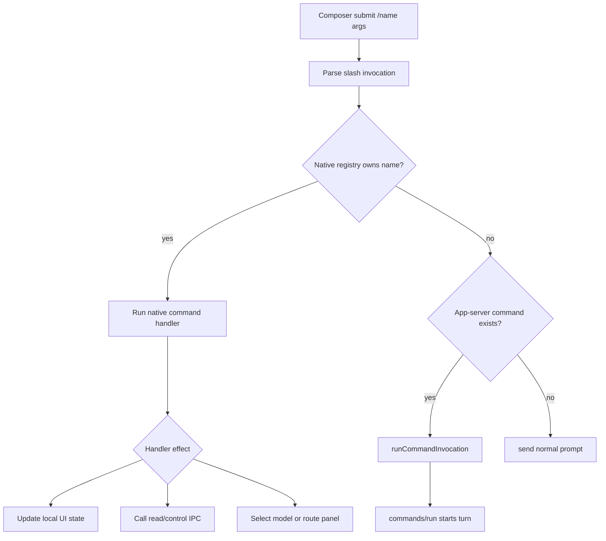
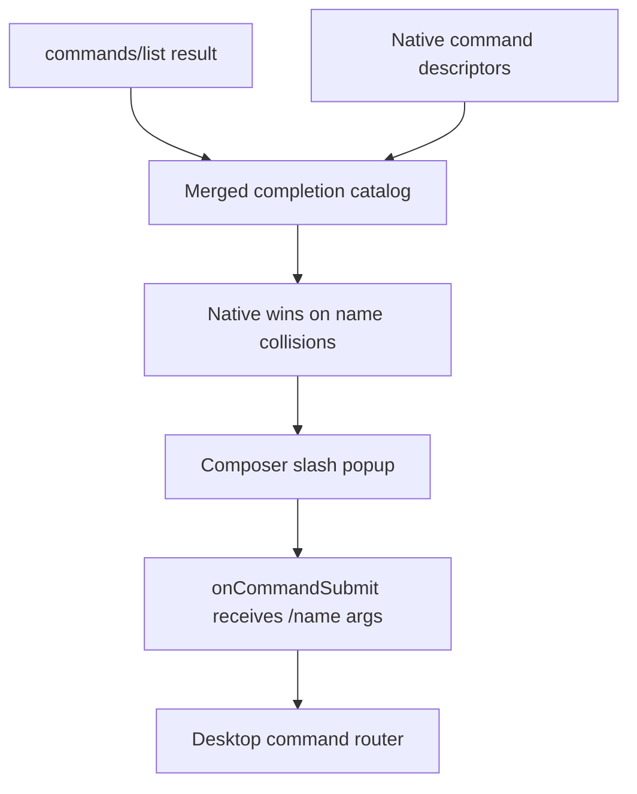

# feat: Add native desktop command layer

## Summary

Add a native desktop command layer that intercepts selected slash commands before the app-server prompt-command path. Desktop should keep custom/app-server commands working through `commands/run`, while native commands such as `/model`, `/clear`, `/retry`, `/agents`, `/tasks`, and `/ps` perform UI/runtime actions directly.

---

## Problem Frame

The current desktop slash-command implementation treats every known command as an app-server prompt command: composer submission parses `/name args`, then `runCommandInvocation` calls `commands/run` to expand a prompt and start a turn. That works for custom commands such as a hypothetical `/review`, but it makes TUI-style commands like `/model` feel broken because their useful behavior is local UI state, not a model prompt.

The TUI already has a two-layer model: local commands are intercepted first, and unmatched commands fall back to `commands/expand`/agent execution. Desktop needs the same architectural split without losing the existing slash completion, warning labels, and command catalog behavior.

---

## Requirements

**Command Routing**

- R1. Desktop slash submission must check a native command registry before routing to app-server-backed `commands/run`.
- R2. Native command names must appear in slash completion alongside app-server commands, with native commands taking precedence when names collide.
- R3. Unknown slash-like prompts and attachment-bearing prompts must preserve current behavior: they are sent as normal prompts rather than native commands.
- R4. App-server prompt commands must continue to create or reuse threads through the existing `commands/run` path.

**Native Command Behavior**

- R5. `/model` with no arguments must open or focus the desktop model selector; `/model <model-id>` must select a known model without starting an agent turn.
- R6. `/clear` must clear the visible local conversation/command display without deleting or archiving the underlying thread.
- R7. `/retry` must resubmit the most recent eligible user prompt when the active thread is idle, and must report a clear unavailable state otherwise.
- R8. `/agents` and `/tasks` must fetch app-server data and present it as native command feedback, not as assistant or model-authored content.
- R9. `/ps` must list Roder-owned processes and support safe stop actions using the app-server process methods.

**User Feedback and Safety**

- R10. Native commands must provide compact, local feedback for success, empty states, and errors without fabricating transcript messages from the agent.
- R11. Destructive process actions must require explicit command text such as `stop <id>` or `stop-all --confirm`.
- R12. Completion and execution tests must cover routing precedence, busy-state behavior, parser edge cases, and at least one command in each native-command category.

---

## Key Technical Decisions

- KTD1. **Desktop-native registry before app-server fallback:** A small desktop registry should own native descriptors and handlers. The submit path should ask this registry first, then fall back to app-server command invocation. This mirrors the TUI's local-command split while preserving custom command support.

- KTD2. **Reuse command descriptors for completion:** Native commands should be projected into the same descriptor shape that the command completion popup already understands. This avoids a second slash UI and keeps sorting, argument hints, and warning display consistent.

- KTD3. **Native feedback is local UI state, not fake transcript protocol:** Commands like `/agents`, `/tasks`, and `/ps` need to show user-visible output, but injecting synthetic Roder turns would blur what the agent actually said. A desktop-local command feedback row/card should sit near the transcript/composer and be cleared by `/clear` or thread changes as appropriate.

- KTD4. **`/model` should drive the existing composer model control:** The command should reuse the current `ModelPicker` state and `setSelectedModel` store action. The picker may need controlled-open support so `/model` can open it without duplicating model UI.

- KTD5. **Process control stays explicit:** `/ps` can list by default and stop by explicit subcommand. Bulk stop should require `stop-all --confirm`, matching the TUI's safety posture and avoiding accidental destructive actions from completion alone.

---

## High-Level Technical Design

---

## Scope Boundaries

### In Scope

- A desktop-native command registry and execution router.
- First native command set: `/model`, `/clear`, `/retry`, `/agents`, `/tasks`, and `/ps`.
- Minimal IPC wrappers and types needed for `/agents`, `/tasks`, and `/ps`.
- Local command feedback UI sufficient for command results and errors.
- Tests for pure routing utilities, store/controller behavior, command-specific handlers, and completion catalog merging.

### Deferred to Follow-Up Work

- A global command palette outside the composer.
- Full TUI parity for `/goal`, `/memory`, `/roadmap`, `/workflows`, `/remote`, `/voice`, and Webwright inspection commands.
- Rich task/process management panels beyond the command feedback surface.
- App-server contract changes for `commands/run` to honor `allowed_tools`, `context_blocks`, or `agent`.
- An opt-out mode for sending a literal `/known-command` message as plain text.

---

## Acceptance Examples

- AE1. Given the command catalog contains an app-server `/model`, when the user submits `/model`, then desktop opens the model selector and does not call `commands/run`.
- AE2. Given the user submits `/review api` and `/review` is only an app-server command, then desktop calls `commands/run` with `name: "review"` and `arguments: "api"`.
- AE3. Given the active thread is running, when the user submits `/retry`, then desktop does not start another turn and shows local unavailable feedback.
- AE4. Given active Roder processes exist, when the user submits `/ps`, then desktop renders a local process summary without adding an assistant message.
- AE5. Given the user submits `/ps stop-all` without `--confirm`, then no stop-all IPC call is made and desktop shows the required confirmation syntax.

---

## Implementation Units

### U1. Native Command Registry And Catalog Merge

- **Goal:** Introduce a pure native-command model that describes desktop-owned slash commands and merges them with app-server descriptors for completion.
- **Requirements:** R1, R2, R3, R12
- **Dependencies:** None
- **Files:** `src/lib/native-commands.ts`, `src/lib/roder-commands.ts`, `src/types/roder.ts`, `test/native-commands.test.ts`, `test/roder-commands.test.ts`
- **Approach:** Define native command metadata with name, description, argument hint, and a handler category. Add a pure merge utility that combines app-server descriptors with native descriptors and dedupes by name with native precedence. Keep parsing in `roder-commands` or a nearby pure module so command-shaped text continues to have one parser.
- **Patterns to follow:** `src/lib/roder-commands.ts` for pure command utilities; the sibling backend repo's `crates/roder-tui/src/app/commands.rs` for the local-command catalog shape.
- **Test scenarios:**
  - Given app-server commands include `model` and `review`, merging native commands returns one `model` descriptor from the native source plus `review`.
  - Given an empty app-server catalog, merging still returns native commands sorted with the same ordering behavior as current completion.
  - Given a slash-like prompt with attachments, command invocation remains unavailable to the submit path.
  - Given an unknown slash command, the parser returns no native or app-server invocation.
- **Verification:** Completion receives a single merged catalog, native descriptors are deterministic, and existing command parsing tests still pass.

### U2. Command Router In The App Shell

- **Goal:** Move command execution classification out of ad hoc submit logic and into a desktop router that can run native handlers or app-server commands.
- **Requirements:** R1, R3, R4, R10, R12
- **Dependencies:** U1
- **Files:** `src/hooks/use-app-shell-controller.ts`, `src/components/app-shell-context.tsx`, `src/pages/chat/chat-page.tsx`, `src/stores/roder-store.ts`, `test/app-shell-native-commands.test.ts`, `test/roder-store-commands.test.ts`
- **Approach:** Add a router used by both direct Enter submission and popup selection. It should receive the parsed invocation, attachments, active thread state, selected workspace/model state, and callback capabilities. Native handlers return a local result or execute UI effects. App-server commands continue through `runCommandInvocation`.
- **Patterns to follow:** Existing `sendPrompt` and `sendCommandInvocation` callback flow in `use-app-shell-controller`; current `runCommandInvocation` tests for thread creation and failure rollback.
- **Test scenarios:**
  - Given `/model` is submitted with no attachments, the router calls the native handler and does not call `runCommandInvocation`.
  - Given `/review api` is submitted and only app-server owns `review`, the router calls `runCommandInvocation`.
  - Given `/model` is submitted with an attachment, the prompt is sent normally and no native command runs.
  - Given the command catalog is not loaded and the text is slash-like, the router still waits for the app-server catalog before deciding fallback behavior.
  - Given a native handler throws, the error is captured as local command feedback and does not mark a thread as running.
- **Verification:** Native and app-server command paths are covered independently, and `commands/run` behavior remains unchanged for custom commands.

### U3. Local Command Feedback Surface

- **Goal:** Provide a desktop-local place for native command results, unavailable states, and errors.
- **Requirements:** R6, R8, R10, R12
- **Dependencies:** U2
- **Files:** `src/components/native-command-feedback.tsx`, `src/components/transcript.tsx`, `src/pages/chat/chat-page.tsx`, `src/hooks/use-app-shell-controller.ts`, `test/native-command-feedback.test.tsx`, `test/transcript-rows.test.ts`
- **Approach:** Add a compact feedback surface aligned with the central work surface, likely near the transcript/composer boundary. It should support concise text, optional grouped rows, and clear/error tones. It should not alter persisted Roder thread data. `/clear` should clear this feedback and hide visible local transcript content according to the chosen local-clear model.
- **Patterns to follow:** Transcript content principles in `docs/design.md`; existing agent error display in `ChatPage`; transcript row modeling tests for non-message rows.
- **Test scenarios:**
  - Given a native command returns a text summary, the feedback surface renders it without adding a new `ConversationMessage`.
  - Given a command returns an error, the feedback surface renders the error tone and preserves composer state.
  - Given `/clear` runs, command feedback is removed and the visible clear state is applied without modifying thread data.
  - Given the active thread changes, stale feedback from the prior thread does not appear in the new thread.
- **Verification:** Native command output is visible, accessible, and clearly separate from agent-authored transcript content.

### U4. `/model`, `/clear`, And `/retry`

- **Goal:** Implement the first local state commands that do not need new app-server read models.
- **Requirements:** R5, R6, R7, R10, R12
- **Dependencies:** U2, U3
- **Files:** `src/lib/native-commands.ts`, `src/components/composer.tsx`, `src/components/composer-controls.tsx`, `src/hooks/use-app-shell-controller.ts`, `src/stores/roder-store.ts`, `test/native-commands.test.ts`, `test/composer-native-commands.test.tsx`, `test/roder-store-native-commands.test.ts`
- **Approach:** Let `/model` with no args open or focus the existing model picker through controlled-open state or a focused signal. Let `/model <id>` select a matching model via `setSelectedModel`; if no model matches, report local feedback. Implement `/clear` as a local visual clear that does not delete thread data. Implement `/retry` using the latest eligible user prompt from the active thread, respecting busy/running state and reporting when no retryable prompt exists.
- **Execution note:** Add behavior tests before wiring UI effects, since these commands are stateful and easy to regress.
- **Patterns to follow:** Current `ModelPicker` props and selected model store actions; TUI `/model` and `/retry` unavailable-state behavior.
- **Test scenarios:**
  - Given `/model` has no args, submitting it opens the model picker and leaves the composer empty.
  - Given `/model gpt-5.5` matches a visible model, submitting it calls `setSelectedModel("gpt-5.5")` and shows success feedback.
  - Given `/model missing-model`, no model selection changes and error feedback names the missing model.
  - Given `/clear`, visible native feedback and local transcript-clear state reset while the underlying thread remains selectable and reloadable.
  - Given `/retry` on an idle thread with a latest text prompt, a new turn starts with that prompt.
  - Given `/retry` while the active thread is running, no turn starts and unavailable feedback is shown.
- **Verification:** These commands perform visible desktop actions and never call `commands/run`.

### U5. `/agents`, `/tasks`, And `/ps` IPC Commands

- **Goal:** Add native commands that read or control app-server state without starting agent turns.
- **Requirements:** R8, R9, R10, R11, R12
- **Dependencies:** U2, U3
- **Files:** `src/lib/roder-ipc.ts`, `src/types/roder.ts`, `src/lib/native-commands.ts`, `src/lib/native-command-formatters.ts`, `test/roder-ipc-native-commands.test.ts`, `test/native-command-formatters.test.ts`, `test/native-commands.test.ts`
- **Approach:** Add typed wrappers for `agents/list`, `tasks/list`, `tasks/get` if log tails are included, `processes/list`, `processes/stop`, and `processes/stopAll`. Format results into compact feedback rows. `/agents` lists configured subagents. `/tasks` lists background tasks with concise state and optional tail. `/ps` lists active processes by default; `all` includes completed processes; `stop <id>` stops one process; `stop-all --confirm` stops all stoppable processes.
- **Patterns to follow:** App-server protocol types in `docs/api.md` and the sibling backend repo's `crates/roder-protocol/src/lib.rs`; TUI formatting behavior for `/agents`, `/tasks`, and `/ps`.
- **Test scenarios:**
  - Given `agents/list` returns no agents, `/agents` renders "No configured subagents" feedback.
  - Given `agents/list` returns agents with model metadata, `/agents` renders agent type, model, and description.
  - Given `tasks/list` returns tasks, `/tasks` renders task id, executor, state, kind, timestamps or equivalent concise metadata.
  - Given `processes/list` returns active processes, `/ps` renders process id, state, command summary, cwd, and stoppable status.
  - Given `/ps stop proc-1`, the process stop wrapper is called with `processId: "proc-1"` and success feedback is shown.
  - Given `/ps stop-all` without `--confirm`, no stop-all IPC call is made and confirmation guidance is shown.
  - Given any native IPC method is unavailable on an older app-server, the command shows a useful unavailable message without breaking normal chat.
- **Verification:** Native read/control commands use app-server methods directly, render local feedback, and have safe destructive behavior.

### U6. Completion, UX Polish, And Regression Coverage

- **Goal:** Make the native/app-server split feel like one coherent slash-command surface.
- **Requirements:** R2, R3, R10, R12
- **Dependencies:** U1, U2, U3, U4, U5
- **Files:** `src/components/command-completion-popup.tsx`, `src/hooks/use-command-completion.ts`, `src/pages/chat/chat-page.tsx`, `src/components/composer.tsx`, `test/command-completion.test.ts`, `test/command-completion-native.test.tsx`, `test/composer-command-completion.test.tsx`
- **Approach:** Feed the merged catalog into the existing popup. Consider a small native/source badge only if needed to distinguish command behavior; avoid overloading the row with explanatory text. Preserve keyboard behavior, mid-token completion behavior, and attachments gating. Add end-to-end-ish component tests for completing and submitting native versus app-server commands.
- **Patterns to follow:** Existing `CommandCompletionPopup`, `useCommandCompletion`, and generic completion popup patterns; UI density guidance from `docs/design.md`.
- **Test scenarios:**
  - Given the popup lists `/model` and `/review`, selecting `/model` submits a native invocation and selecting `/review` submits an app-server invocation.
  - Given native and app-server descriptors share `model`, the popup shows one row with the native description and argument hint.
  - Given attachments exist, slash completion remains hidden and Enter sends the prompt normally.
  - Given Escape closes the popup, subsequent Enter behavior remains consistent with the existing slash-command tradeoff.
- **Verification:** Users see one command surface, while implementation routes native and app-server commands correctly.

---

## Risks & Dependencies

- **Feedback surface ambiguity:** Desktop currently lacks a local system-message primitive. Mitigation: keep native command feedback visually distinct from agent transcript content and test that it does not mutate thread data.
- **Model picker control coupling:** Opening the existing `ModelPicker` from `/model` may require making its open state controllable. Mitigation: keep the API local to composer controls and avoid introducing a global modal.
- **Older app-server compatibility:** Some native commands require methods desktop does not call today. Mitigation: guard unavailable methods with clear feedback and keep normal prompt submission unaffected.
- **Scope creep toward a global palette:** The registry will be reusable, but this plan intentionally limits UI to composer slash commands.
- **Literal slash messages remain intercepted:** The existing known-command tradeoff continues. A future opt-out can be designed separately.

---

## Sources & Research

- `src/hooks/use-app-shell-controller.ts` currently decides whether to call `runCommandInvocation` or send a normal prompt.
- `src/stores/roder-store.ts` owns `runCommandInvocation` and the existing `commands/run` turn-start behavior.
- `src/lib/roder-commands.ts` contains pure slash parsing, matching, completion replacement, and warning helpers.
- `src/components/composer.tsx` already receives command descriptors, model state, and selected-model callbacks.
- Sibling backend repo `crates/roder-tui/src/app.rs` shows the TUI pattern: local commands branch first, then custom commands expand and start/steer prompts.
- Sibling backend repo `crates/roder-tui/src/app/commands.rs` shows the TUI local command catalog and help text.
- `docs/design.md` frames transcript and tool UI as a local workbench where command results should remain steady, compact, and clearly tied to the active thread.
