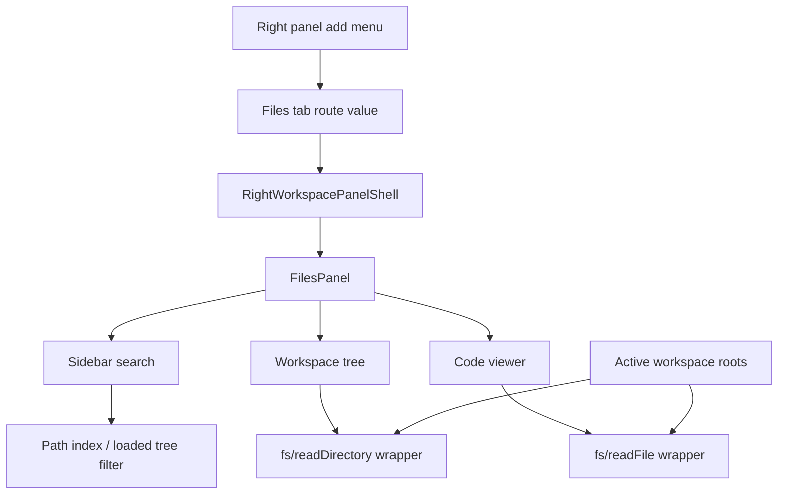

# feat: Add file view right-panel tab

## Summary

Add a read-only Files tab to the right workspace panel. Users can create the tab from the panel add menu, browse the selected workspace's roots in a tree, search file names and paths from the sidebar, and open source files in a code viewer without leaving the current thread.

---

## Problem Frame

Roder's right workspace panel already hosts practical adjacent work surfaces such as Terminal, Browser, Canvas, Review, and Extensions. The app can show changed files through Review, but it does not yet have a neutral way to inspect arbitrary workspace files while staying in the thread. The requested file view should use the existing tabbed right-panel model and the tree library already used for Review, while keeping the first version focused on viewing rather than editing or full IDE behavior.

---

## Requirements

**Right-Panel Tab**

- R1. The workspace panel add menu includes a Files option that opens or focuses a Files tab.
- R2. URL-backed panel state recognizes the Files tab as a supported right-panel tab value.
- R3. The Files tab remains mounted like other panel tabs so tree expansion, search text, and selected file state survive tab switches.

**Workspace Browsing**

- R4. The Files tab roots browsing at the active workspace and supports every registered workspace root, with clear root labels when more than one root exists.
- R5. The sidebar renders a file tree using the existing tree library pattern from Review.
- R6. Directory loading is bounded and incremental enough to avoid freezing the renderer on large workspaces.
- R7. File search in the sidebar searches file names and relative paths, not file contents.

**File Viewing**

- R8. Selecting a text file opens it in a read-only code viewer with the relative path visible.
- R9. Binary files, unreadable files, and files too large for the first version show non-destructive fallback states instead of broken text.
- R10. The feature does not edit files, stage changes, open external editors, or perform git operations.
- R11. If the connected app-server does not advertise filesystem read/list support, the Files tab shows an upgrade/unavailable state instead of failing during interaction.
- R12. File selection, search, and absolute path derivation are root-aware so duplicate relative paths in different roots remain distinct.

---

## High-Level Technical Design

The Files tab should behave like a first-class hosted panel, not a modal or a Review submode. The tree and search live in a left sidebar inside the tab; the selected file renders in the remaining code-view area. Filesystem access should go through typed renderer IPC wrappers over the existing app-server `fs/readDirectory` and `fs/readFile` methods.

---

## Key Technical Decisions

- KTD1. Files is a right-panel tab type: Add Files to the same tab model and registry as Terminal, Browser, Canvas, Review, and Extensions. This honors the user's explicit entry point and keeps panel lifecycle behavior consistent.
- KTD2. Use workspace roots as the browse boundary: The tab should read the active workspace's registered roots, show all roots when a workspace has more than one, and derive absolute host paths from a root id plus relative path. This keeps the UI aligned with the workspace the user sees in chrome and avoids arbitrary filesystem browsing in the first version.
- KTD3. Reuse `@pierre/trees` for the sidebar tree: Review already injects app-specific tree styling, selection normalization, search input styling, and sticky folder behavior. Extending that pattern gives the Files tab the same interaction language.
- KTD4. Path search, not content search: Sidebar search should match file names and relative paths. Full-text search needs indexing, result ranking, match previews, and cancellation semantics that are better planned as a follow-up.
- KTD5. Plain read-only code rendering first: Use a stable monospaced viewer with line-preserving text, scroll, copy/select behavior, and file metadata. Syntax highlighting can be added only if it uses an existing dependency or a lightweight local mapping; it should not introduce a new dependency unless implementation proves the viewer is too poor without it.
- KTD6. Gate on advertised filesystem support: Follow Review's app-server capability posture by detecting whether `fs/readDirectory` and `fs/readFile` are available before enabling browsing. Concretely, mirror `use-review-changes.ts:130` and gate on `appServerMethods.includes("fs/readDirectory") && appServerMethods.includes("fs/readFile")`, where `appServerMethods` is the same `string[]` already threaded into the render context. This keeps older desktop/app-server combinations understandable.
- KTD7. TDD where behavior is clear: Route support, IPC payloads, path normalization, tree/search state, and file read states are testable through public helpers and component output. Pure visual polish should be verified through typecheck and desktop app review rather than brittle class-name tests.

---

## Scope Boundaries

### In Scope

- Add the Files tab type to panel route state, the right-panel registry, the add menu, and empty state copy.
- Build a read-only Files panel with sidebar tree, path search, selected-file state, and code viewer.
- Add typed renderer IPC wrappers for existing filesystem read/list methods.
- Support multi-root workspaces by grouping or switching roots in the Files sidebar.
- Handle missing workspace, empty directory, binary file, large file, and read-error states.
- Verify the tab in the running Electron app because the renderer depends on desktop preload APIs.

### Deferred to Follow-Up Work

- Full-text file-content search.
- File editing, saving, rename/delete/create operations, drag/drop, and git actions.
- Binary, image, markdown, PDF, notebook, or rich document previews.
- Multiple Files tab instances with independent selected roots or custom folder scopes.
- Persisted per-workspace tree/search/selection state outside the existing mounted tab lifecycle.

---

## System-Wide Impact

This feature touches URL search state, right-panel tab registration, workspace-root consumption, renderer IPC wrappers, and a new panel component. It should not require app-server changes because `docs/api.md` already documents `fs/readDirectory` and `fs/readFile`. The main product risks are performance on large repositories and correct behavior for workspaces with multiple roots; the plan keeps directory traversal bounded, search limited to paths, and file identities root-aware.

---

## Implementation Units

> Note on shared files: U3, U4, and U5 are layered passes over the same `src/components/file-panel.tsx`, `src/lib/file-panel.ts`, and `test/file-panel.test.ts`. U3 builds the state/helper layer, U4 the sidebar/tree rendering, and U5 the viewer. Treat them as sequential edits to a growing module rather than independent files, and keep `src/lib/file-panel.ts` as the pure, test-first core that the component composes.

### U1. Register Files as a Right-Panel Tab

**Goal:** Make Files a supported right-panel tab option that can be opened, focused, serialized, and closed like existing tabs.

**Requirements:** R1, R2, R3

**Dependencies:** None

**Files:**

- `src/lib/route-search.ts`
- `src/components/right-workspace-panel-registry.tsx`
- `src/components/right-workspace-panel-shell.tsx`
- `test/route-search.test.ts`
- `test/right-workspace-panel-shell.test.ts`

**Approach:** Add a `files` panel value to the fixed tab literal set, route normalization, serializer behavior, registry entries, and add-menu/empty-state presentation. Use a file-oriented icon from `lucide-react`. Keep the shell content-agnostic; Files-specific state belongs in the Files panel rather than the shell.

**Patterns to follow:** `workspacePanelValues`, `openWorkspacePanelTab`, `closeWorkspacePanelTab`, `rightWorkspacePanelEntries`, and the existing add-menu item shape in `right-workspace-panel-shell.tsx`.

**Test scenarios:**

- Given URL state with `files` in `panelTabs`, normalization preserves it and can make it the active panel.
- Given URL state with `files` plus an unsupported panel value, normalization preserves Files and drops only the unsupported value.
- Given Files is opened through the panel action helper twice, the existing tab is focused rather than duplicated.
- Given Files is the active tab and closes, route state selects the nearest remaining tab or closes the shell when none remain.
- Given the shell renders an empty state, Files appears with title, description, and icon alongside the existing panel choices.

**Verification:** Route and shell tests prove Files participates in tab lifecycle without special-casing outside the registry.

### U2. Add Filesystem IPC Wrappers and Types

**Goal:** Expose typed renderer helpers for workspace file browsing using the existing app-server filesystem contract.

**Requirements:** R4, R6, R8, R9, R11

**Dependencies:** None

**Files:**

- `src/lib/roder-ipc.ts`
- `src/types/roder.ts`
- `test/roder-ipc-review.test.ts`

**Approach:** Add result types for `fs/readDirectory` and `fs/readFile`, then add `roderIpc.readDirectory` and `roderIpc.readFile` wrappers that pass absolute paths exactly as required by the backend contract. Keep wrapper names generic enough for future reuse but do not broaden the feature into writes. Update the existing IPC wrapper test file or split a focused filesystem IPC test if that is cleaner during implementation.

**Exact backend contract (from `docs/api.md`):**

- `fs/readDirectory` request is `{ path: string }` (absolute); response is `{ entries: FsDirectoryEntry[] }` where each entry is `{ fileName: string; isDirectory: boolean; isFile: boolean }`. Entries arrive sorted by `fileName` (alphabetical only — not folders-first), and only direct children are returned.
- `fs/readFile` request is `{ path: string }` (absolute); response is `{ dataBase64: string }` (whole-file, no paging).
- Both methods reject relative paths with code `-32602` / `"path must be absolute"`, and surface read failures as `-32000` with `data.details`. Wrappers should let these JSON-RPC errors propagate so callers can render the message.
- Suggested type names: `FsDirectoryEntry`, `FsReadDirectoryResult`, `FsReadFileResult` in `src/types/roder.ts`. Use the exact field names `fileName` and `dataBase64` — do not invent `name`/`path`/`data`.

**Execution note:** Start with failing IPC wrapper tests for method names and payload shapes before wiring the panel.

**Patterns to follow:** Existing `listVcsChanges`, `readVcsChange`, `listHunks`, and `readHunk` wrappers in `src/lib/roder-ipc.ts`; `docs/api.md` filesystem method contract.

**Test scenarios:**

- Calling `readDirectory` with an absolute path sends `fs/readDirectory` with `{ path }` and returns `entries` of `{ fileName, isDirectory, isFile }`.
- Calling `readFile` with an absolute path sends `fs/readFile` with `{ path }` and returns `{ dataBase64 }`.
- Wrapper types preserve `fileName`, `isDirectory`, and `isFile` for directory entries (not renamed to `name`/`path`).
- A relative path argument surfaces the backend's `-32602` error rather than being silently normalized by the wrapper.
- Filesystem wrapper tests do not require Electron preload APIs beyond the existing mocked `window.roderDesktop.request`.

**Verification:** IPC unit tests prove renderer wrappers match the documented app-server contract.

### U3. Build Workspace Tree and Path Search State

**Goal:** Provide the Files panel sidebar with a workspace tree, lazy directory loading, selection, and path search.

**Requirements:** R4, R5, R6, R7, R9, R11, R12

**Dependencies:** U2

**Files:**

- `src/lib/file-panel.ts`
- `src/hooks/use-file-panel-tree.ts`
- `src/components/file-panel.tsx`
- `test/file-panel.test.ts`

**Approach:** Add pure helpers for root-aware file ids, relative/absolute path joining, workspace-boundary checks per root, directory-entry sorting, ignored directory defaults, and path-search filtering. Add a hook that loads each visible workspace root and expanded directories through `roderIpc.readDirectory`, tracks loading/error state by root and directory, and exposes tree paths for `@pierre/trees`. Search should match loaded paths immediately and may maintain a bounded recursive path index per root for file-name/path search, with cancellation and result limits so large repositories stay responsive.

**Execution note:** Implement pure path and filtering helpers test-first before connecting them to React state.

**Patterns to follow:** `ReviewFileTree` selection normalization and tree configuration in `src/components/review-panel.tsx`; pure helper style in `src/lib/review-panel-ui.ts`; workspace path normalization in `src/lib/roder-workspaces.ts`.

**Test scenarios:**

- Given a single-root workspace, helper functions produce relative tree paths and absolute read paths without escaping the root.
- Given a multi-root workspace with duplicate relative paths, helper functions produce distinct root-aware ids and absolute paths for each file.
- Given direct directory entries with mixed files/folders, the helper applies folders-first grouping on top of the backend's alphabetical-by-`fileName` order (the backend only sorts alphabetically, not folders-first).
- Given a relative selection plus a root `path`, the absolute-path helper produces an absolute path so `fs/*` calls never trigger the backend's `-32602 path must be absolute` error.
- Given common heavy directories are encountered during recursive search indexing, the indexer skips or bounds them according to the helper policy.
- Given search text matches nested file paths across multiple roots, the filtered result includes matching files, necessary parent folders, and enough root context to disambiguate them.
- Given a directory read fails, the hook keeps previously loaded paths and exposes an error state for that directory.
- Given no workspace roots are available, the hook exposes an empty state and performs no filesystem calls.
- Given filesystem methods are not advertised by the app-server, the hook exposes an unavailable state and performs no filesystem calls.

**Verification:** Helper and hook tests prove path safety, search behavior, bounded traversal, and error preservation without depending on visual class names.

### U4. Render the Files Panel Tree and Sidebar

**Goal:** Create the visible Files panel sidebar using the tree library and local design conventions.

**Requirements:** R3, R4, R5, R7, R11, R12

**Dependencies:** U1, U3

**Files:**

- `src/components/file-panel.tsx`
- `src/components/right-workspace-panel-registry.tsx`
- `src/style.css`
- `test/file-panel.test.ts`

**Approach:** Render a two-column Files panel: a fixed-width sidebar with search and tree, and a flexible code-view region. Reuse `@pierre/trees/react` with a Files-specific unsafe CSS block derived from Review's tree styling so search input, selection, fonts, and sticky folders match the app. For multi-root workspaces, render roots as top-level groups or provide an equivalent compact root switcher that keeps the current root visible. Selecting a file updates panel-local root-aware selection; selecting or expanding a directory loads children as needed. Preserve tree expansion and search text while the tab stays mounted.

**Patterns to follow:** `ReviewFileTree`, `reviewFileTreeUnsafeCSS`, `workspace-scrollbar`, icon button sizing in Review headers, and `docs/design.md` surface/radius/typography defaults.

**Test scenarios:**

- Given Files renders with no workspace, it shows a clear workspace-needed state and no tree.
- Given Files renders without filesystem method support, it shows a clear unavailable state and no tree.
- Given Files renders with multiple workspace roots, each root is visible or selectable by name and duplicate child paths remain distinguishable.
- Given Files renders with loaded entries, file and folder names appear in the tree and selecting a file calls the selected-path handler.
- Given search text is entered, the visible tree result narrows to matching file names/paths without triggering content search.
- Given a directory is expanded, the panel requests that directory's children only once unless refreshed during implementation.
- Given an unreadable directory reports an error, the sidebar shows the error near that directory or in a compact panel alert without losing other entries.

**Verification:** Component tests cover empty, loaded, search, select, and directory-error states; final UI should be checked in the Electron app for sizing and focus behavior.

### U5. Add Read-Only Code Viewer

**Goal:** Display selected text files in a stable read-only code area with loading, error, large-file, and binary fallbacks.

**Requirements:** R8, R9, R10, R12

**Dependencies:** U2, U3, U4

**Files:**

- `src/components/file-panel.tsx`
- `src/lib/file-panel.ts`
- `test/file-panel.test.ts`

**Approach:** Decode the `dataBase64` field from `fs/readFile` into bytes, detect binary or unsupported content before rendering, and render text in a scrollable monospaced area that preserves line breaks and user selection. Keep line numbers optional during implementation; include them only if they can be rendered without layout jank or large-file cost. Add a size threshold for the first version because the backend method returns whole-file content rather than pages.

**Concrete guidance:**

- Binary detection: decode a bounded prefix of the bytes and treat the file as binary if it contains a NUL byte or fails strict UTF-8 decoding. Keep this in a pure helper in `src/lib/file-panel.ts` so it is unit-testable without the component.
- Size threshold: because `fs/readFile` has no paging, pick and document an explicit byte ceiling (the implementer should choose a concrete value, e.g. ~1–2 MB of decoded content) and short-circuit to the too-large fallback before constructing the `pre`. Where possible, decide from the base64 length so the oversized string is never decoded into a giant DOM node.

**Patterns to follow:** Code typography guidance in `docs/design.md`; fallback/error treatment in `ReviewPanel`; compact `pre` usage in settings and plugin detail surfaces.

**Test scenarios:**

- Given a selected text file, the viewer reads the absolute path for the selected root and renders decoded text under a header that includes enough path/root context to disambiguate it.
- Given a second file is selected before the first read resolves, stale read results do not replace the newer selection.
- Given `readFile` fails, the viewer shows an error state and keeps the selected path visible.
- Given bytes appear binary or the file type is not text-renderable, the viewer shows a binary-file fallback instead of malformed text.
- Given file content exceeds the first-version threshold, the viewer shows a too-large fallback rather than rendering an oversized `pre`.
- Given no file is selected, the viewer shows a quiet empty state inviting file selection.

**Verification:** Unit/component tests prove file read state transitions, stale request handling, and fallback states.

### U6. Wire Files into App Shell Context and Verify Desktop Behavior

**Goal:** Pass workspace context into the Files tab, ensure the add-menu flow works end to end, and verify the feature inside Electron.

**Requirements:** R1, R3, R4, R8, R10, R11, R12

**Dependencies:** U1, U2, U3, U4, U5

**Files:**

- `src/hooks/use-app-shell-controller.ts`
- `src/components/app-shell-layout.tsx`
- `src/components/right-workspace-panel-registry.tsx`
- `src/components/file-panel.tsx`
- `test/route-search.test.ts`
- `test/file-panel.test.ts`

**Approach:** Extend `RightWorkspacePanelRenderContext` only with the workspace values, registered roots, selected/default root id, and app-server method list Files actually needs, then render `FilePanel` from the registry branch. Confirm inactive Files content is inert through the shell and that the mounted tab preserves selection/search state on tab switches. Keep visual verification in the desktop app, because plain browser automation against the Vite renderer can be misleading for this project.

**Roots threading (important — currently missing):** The render context today only carries `activeWorkspaceRef: { workspaceId, rootId }` — the full root list is _not_ yet plumbed to the panel. Derive the active workspace's roots in `use-app-shell-controller.ts` from `agent.workspaces` (each `Workspace` has `roots: WorkspaceRoot[]` and `defaultRootId`; `agent` is exposed via `use-roder-agent.ts`): find the workspace whose `id === activeWorkspaceRef.workspaceId`, then pass its `roots` plus `defaultRootId` (falling back to `activeWorkspaceRef.rootId`) down through `AppShellLayout` into the `renderRightWorkspacePanel` context. `WorkspaceRoot` is `{ id, path, name }`, which gives the panel both the stable root id for root-aware file ids and the absolute `path` needed to join relative selections for `fs/*` calls. Add the new context fields next to `activeWorkspaceRef` in `RightWorkspacePanelRenderContext`.

**Patterns to follow:** Existing Review context wiring through `AppShellLayout`, registry render branches in `right-workspace-panel-registry.tsx`, and `docs/design.md` desktop verification guidance.

**Test scenarios:**

- Given Files is chosen from the add menu, the shell opens Files as the active tab.
- Given the active workspace changes, the Files panel resets or reloads against the new root rather than showing stale paths from the previous workspace.
- Given the active workspace has multiple roots, the Files panel receives all registered roots and initially highlights the selected/default root without hiding the others.
- Given filesystem methods are not advertised, the Files tab opens but displays the unavailable state instead of issuing read calls.
- Given Files is inactive, its controls are not focusable but its state is preserved when returning to the tab.
- Given all Files panel state is local to the mounted tab, closing and reopening Files starts from a clean selection/search state.

**Verification:** Typecheck and targeted tests pass; the user verifies in the running desktop app that the Files tab opens from the right-panel add menu, searches paths, browses directories, and displays text files without overlap or blank states.

---

## Acceptance Examples

- AE1. Given a user opens the right-panel add menu and chooses Files, then the right panel opens a Files tab and the tab strip marks Files active.
- AE2. Given a selected workspace contains `src/components/app-shell-layout.tsx`, when the user searches for `app shell`, then the sidebar can reveal the matching path and selecting it opens the file in the viewer.
- AE3. Given the user switches from Files to Review and back, then the Files tree expansion, search text, and selected file are still present.
- AE4. Given the selected item is binary or too large, then the viewer shows an explanatory fallback and does not attempt to render corrupted text.
- AE5. Given no workspace is selected, then the Files tab shows a non-destructive empty state instead of calling filesystem methods with an invalid path.
- AE6. Given the connected app-server lacks filesystem read/list methods, then the Files tab shows an unavailable state and does not issue filesystem requests.
- AE7. Given a workspace has two roots that both contain `README.md`, when the user searches for `README`, then both results remain distinguishable and opening one reads from the correct root.

---

## Risks & Dependencies

- Large workspace traversal: recursive path search can become expensive. Bound search indexing, skip common heavy directories, and keep directory expansion incremental.
- Whole-file reads: `fs/readFile` returns full base64 content, so the viewer needs a first-version size threshold until paged reads exist.
- Multi-root identity: duplicate relative paths can exist under different roots. File ids, tree selection, search results, and viewer state must include root identity rather than using relative path alone.
- Path safety: the renderer will derive absolute paths for backend calls. Helper tests should prove relative selections cannot escape the selected workspace root or cross from one root into another.
- Tree library styling: `@pierre/trees` stores unsafe CSS on the model. Follow the Review remount pattern during development so style changes are visible under Fast Refresh.
- Desktop-only APIs: filesystem calls depend on the Electron preload/app-server path. Visual verification should happen in the running desktop app rather than a plain browser.

---

## Sources & Research

- `docs/design.md` defines the product UI defaults and desktop verification constraint.
- `docs/api.md` documents existing `fs/readDirectory` and `fs/readFile` methods.
- `src/lib/route-search.ts` owns URL-backed right-panel tab state.
- `src/components/right-workspace-panel-shell.tsx` owns add menu, tab strip, mounted inactive content, and empty state behavior.
- `src/components/right-workspace-panel-registry.tsx` registers and renders current right-panel tab types.
- `src/components/review-panel.tsx` demonstrates `@pierre/trees` integration, tree search styling, selection normalization, and file-sidebar layout.
- `src/lib/roder-ipc.ts` shows typed renderer wrappers over app-server request methods.
- `test/route-search.test.ts`, `test/right-workspace-panel-shell.test.ts`, and `test/roder-ipc-review.test.ts` are the nearest test patterns for the planned route, shell, and IPC work.
