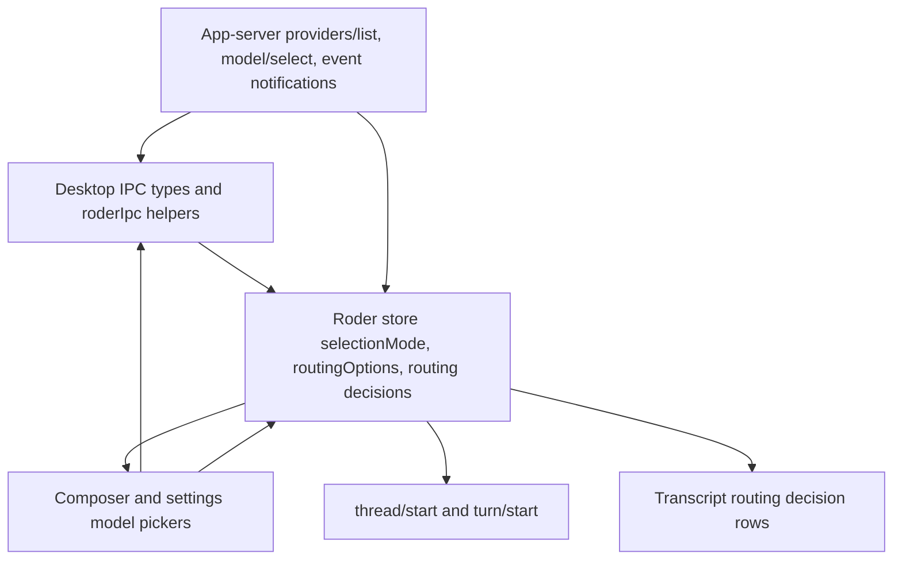

# feat: Integrate auto model routing in desktop

## Summary

Integrate Roder's Auto model selection mode into Desktop as a first-class selection mode rather than a fake provider/model. Desktop should let users select configured router options in the same places they choose models today, save Auto as the default when appropriate, and show turn-level routing decisions in the transcript.

---

## Problem Frame

The backend now exposes adaptive inference routing through `providers/list` routing options, the canonical `model/select` method, persisted `selectionMode` state, and `inference.routing_decision` events. Desktop still models selection as `modelProvider + model`, persists defaults through Manual-only `providers/select`, and drops generic app-server `event` notifications before they reach renderer state. That means Auto can be selected only by bending existing model fields, and the user cannot see when the router changes the concrete model during a turn.

This plan keeps the client aligned with the backend contract: concrete provider/model fields remain the baseline or routed result, while `selectionMode` carries the user's intent.

---

## Requirements

- R1. Desktop must represent Manual and Auto as typed selection modes while preserving concrete provider/model fields for existing baseline display and backend compatibility.
- R2. The model picker must include available router options from `providers/list.routingOptions` without inserting fake Auto providers or fake Auto models into real model lists.
- R3. General settings must allow saving an Auto routing option as the app-level default when the app-server exposes one.
- R4. Active-thread and composer model changes must use `model/select` so Manual and Auto choices update thread selection consistently.
- R5. Starting a new thread or turn must preserve Auto selection intent instead of collapsing it to the baseline concrete model.
- R6. Transcript rendering must show routing decisions when Auto chooses, escalates, falls back, or abstains, including the selected concrete model and the baseline when they differ.
- R7. Routing decision display must be stable across streamed notifications, thread reloads, search text, and virtualization.
- R8. Desktop docs and API types must describe the new client-facing selection contract and the limits of in-client router configuration.

---

## Key Technical Decisions

- **Selection mode is the source of intent:** Add `ModelSelectionMode` and routing-option types to Desktop and store them alongside the existing concrete provider/model fields. Existing provider/model fields continue to describe the baseline or resolved concrete model.
- **Use `model/select` for picker actions:** Migrate default and thread model selection away from `providers/select` for new code. Keep `providers/select` only as a legacy helper if still needed by older app-server builds during local development.
- **Router options join picker data, not model data:** Render routing options as an "Auto" group in the model picker and default settings select. Do not append them to `RoderModel[]`, because current helpers intentionally reason about real models.
- **Settings configure selection first, policy editing later:** V1 Desktop settings should let users choose an available Auto route option as the default and inspect availability/diagnostic text. Editing router tiers, prices, profiles, or classifier policy should be deferred until the app-server exposes a writable router-config method.
- **Transcript uses app-server events:** Stop dropping generic `event` notifications in Electron for event kinds Desktop cares about, project `inference.routing_decision` into renderer state, and render those decisions as compact timeline rows.
- **Provider/model keying must become provider-aware:** Any model visibility or selection logic touched by Auto should key choices by `provider:model`, since duplicate model ids are already possible and router baselines make provider identity more important.

---

## High-Level Technical Design

The data flow has two loops. Selection data flows from `providers/list` into Desktop pickers, then chosen Manual or Auto modes flow back through `model/select`. Runtime routing decisions flow from generic app-server events into store state, then into transcript rows keyed by turn.

---

## Scope Boundaries

### In Scope

- Desktop TypeScript DTOs for selection modes, routing options, `model/select`, and routing status/decision events.
- Store changes for default and per-thread Auto selection.
- Composer/native model picker and General settings picker support for Auto options.
- Transcript rows for routing decisions.
- Desktop API documentation updates.

### Deferred to Follow-Up Work

- A full router policy editor for tiers, prices, classifier prompts, and profiles.
- Routing metrics dashboards beyond the transcript row and optional status summary.
- Backend changes to make router configuration writable from Desktop.
- Visual verification in a plain browser; product UI verification should happen in the Electron shell.

---

## System-Wide Impact

This change touches the client contract with the app-server, persisted renderer state, thread start behavior, active-turn notifications, and transcript rendering. The highest-risk boundary is preserving user intent: Auto mode must not silently degrade to Manual baseline selection when the user starts a thread, reloads a thread, or switches away and back.

---

## Implementation Units

### U1. Add desktop protocol types for routing selection

**Goal:** Teach Desktop about selection modes, routing options, and routing decision payloads without changing behavior yet.

**Requirements:** R1, R2, R6, R8

**Dependencies:** None

**Files:**

- `src/types/roder.ts`
- `src/lib/roder-ipc.ts`
- `test/desktop-protocol-contract.test.ts`
- `test/roder-ipc-policy-mode.test.ts`

**Approach:** Add TypeScript unions matching backend `ModelSelectionMode` and `ModelSelectChoice`, plus `InferenceRoutingOptionDescriptor`, `InferenceRoutingDecisionEvent`, routing status, and routing metrics result shapes. Extend `RoderThread`, `ThreadStartResult`, and provider-list result types with `selectionMode` and `routingOptions`. Add `listProviders` and `selectModel` IPC helpers so Desktop can read routing options from `providers/list` and post `model/select` with either Manual or Auto selection plus optional `threadId`.

**Patterns to follow:** Existing DTO style in `src/types/roder.ts`; method wrappers in `src/lib/roder-ipc.ts`; protocol fixture tests in `test/desktop-protocol-contract.test.ts`.

**Test scenarios:**

- In `test/desktop-protocol-contract.test.ts`, deserialize a provider-list fixture with one routing option and assert the option remains separate from provider models.
- In `test/desktop-protocol-contract.test.ts`, deserialize Manual and Auto `selectionMode` fixtures on threads and thread-start results.
- In a focused IPC test, `listProviders` calls `providers/list` and preserves `routingOptions`.
- In `test/roder-ipc-policy-mode.test.ts` or a new focused IPC test, selecting Auto sends `model/select` with `{ type: "auto", optionId }` and the active thread id when supplied.
- In the same IPC test, selecting Manual sends `{ type: "manual", provider, model, reasoning }` and does not call `providers/select`.

**Verification:** Desktop can parse and send the new app-server contract before any UI depends on it.

### U2. Model selection helpers with provider-aware keys

**Goal:** Make model and routing-option selection helpers safe for duplicate model ids and Auto options.

**Requirements:** R1, R2, R4

**Dependencies:** U1

**Files:**

- `src/lib/roder-models.ts`
- `src/lib/native-commands.ts`
- `src/lib/native-command-router.ts`
- `test/roder-models.test.ts`
- `test/native-commands.test.ts`
- `test/native-command-router.test.ts`

**Approach:** Introduce a stable model key helper using provider plus model id and keep routing option ids in a separate namespace. Update visibility helpers touched by this work to avoid id-only sets where provider collisions matter. Keep slash-command `/model` Manual-only unless an Auto option is explicitly matched by label or option id, so command behavior remains predictable.

**Patterns to follow:** Existing `selectedModelRecord` duplicate-provider test in `test/roder-models.test.ts`; native command planning in `src/lib/native-commands.ts`.

**Test scenarios:**

- In `test/roder-models.test.ts`, two providers with the same model id can be independently selected and hidden without selecting the wrong provider.
- In `test/roder-models.test.ts`, visible-model compaction still stores an empty override when all concrete model keys are visible.
- In `test/native-commands.test.ts`, `/model gpt-5.5` keeps resolving a concrete model when unique.
- In `test/native-command-router.test.ts`, selecting an Auto option by explicit option id routes through `model/select` rather than `setSelectedModel` if the command path supports Auto in this slice.

**Verification:** Auto integration does not worsen existing duplicate-model behavior or leak routing options into real model collections.

### U3. Store selection mode and route picker actions through `model/select`

**Goal:** Preserve Manual or Auto selection state across bootstrap, thread switching, new thread creation, and active-thread model changes.

**Requirements:** R1, R3, R4, R5

**Dependencies:** U1, U2

**Files:**

- `src/stores/roder-store.ts`
- `src/hooks/use-roder-agent.ts`
- `src/hooks/use-app-shell-controller.ts`
- `src/components/app-shell-context.tsx`
- `test/roder-store.test.ts`
- `test/roder-store-commands.test.ts`

**Approach:** Add `routingOptions`, `defaultSelectionMode`, and `selectedSelectionMode` to the store. Bootstrap from `providers/list`, `model/list`, and `settings/get`: `providers/list` supplies routing options and active selection mode, while `model/list` remains the concrete model descriptor source used by existing UI. Replace default save and active-thread model selection calls with `roderIpc.selectModel`; when saving an Auto default, accept that app-server persistence is process-local until backend exposes durable Auto config persistence. Pass `selectionMode` on `thread/start` when supported, or use `model/select` immediately after thread creation if the app-server requires the canonical method.

**Patterns to follow:** Current `threadControlsByThread` handling for per-thread model/reasoning/policy mode; `saveDefaults` optimistic/error handling; `createThreadForPrompt` state reconciliation.

**Test scenarios:**

- In `test/roder-store.test.ts`, bootstrap stores routing options and an Auto default selection mode returned by provider-list.
- In `test/roder-store.test.ts`, saving defaults with an Auto selection calls `model/select` without `threadId` and updates default concrete provider/model/reasoning from the response.
- In `test/roder-store.test.ts`, selecting Auto for an active thread calls `model/select` with `threadId` and updates `threadControlsByThread` to Auto mode.
- In `test/roder-store.test.ts`, starting a new thread from an Auto default preserves Auto `selectionMode` in the created thread state.
- In `test/roder-store-commands.test.ts`, native command and composer selection paths update the same store fields for Manual selections as before.
- Error path: when `model/select` rejects an unavailable Auto option, the store preserves the previous selection and exposes the error.

**Verification:** Reloading and switching threads does not collapse Auto back to Manual baseline unless the app-server reports only Manual state.

### U4. Surface Auto in settings and model pickers

**Goal:** Make Auto discoverable and selectable in the existing Desktop UI without introducing a separate fake model provider.

**Requirements:** R2, R3, R4, R8

**Dependencies:** U1, U2, U3

**Files:**

- `src/components/settings-general-panel.tsx`
- `src/components/settings-models-panel.tsx`
- `src/components/composer-controls.tsx`
- `src/components/native-model-picker.tsx`
- `src/components/settings-view.tsx`
- `test/composer-controls.test.ts`
- `test/native-model-picker.test.ts`
- `test/roder-store.test.ts`

**Approach:** Add an Auto group to the General settings model select and composer model picker when `routingOptions` is non-empty. Display the routing option label as the primary name and baseline provider/model as secondary metadata. Keep Models visibility focused on concrete models; add a quiet informational row or empty state when routing is unavailable rather than adding toggles for Auto. If settings navigation needs a dedicated route later, prefer a compact section under Models or General over a new top-level placeholder.

**Patterns to follow:** Base UI `Select` usage in `src/components/settings-general-panel.tsx`; `Combobox` grouping in `src/components/composer-controls.tsx`; native picker grouping in `src/components/native-model-picker.tsx`; design defaults in `docs/design.md`.

**Test scenarios:**

- In `test/composer-controls.test.ts`, the model picker renders an Auto group when routing options are present and calls the Auto selection handler with the option id.
- In `test/composer-controls.test.ts`, Manual models still render grouped by provider and keep existing provider-logo behavior.
- In `test/native-model-picker.test.ts`, keyboard selection can choose an Auto option and close the picker.
- In `test/native-model-picker.test.ts`, searching matches Auto option labels, profiles, and baseline model text.
- In `test/roder-store.test.ts`, hidden concrete models do not hide routing options, but unavailable routing options are not shown.

**Verification:** Users can choose Auto in settings or an active thread, and the UI copy makes clear that Auto is a router option backed by a baseline model.

### U5. Preserve routing events from Electron into renderer state

**Goal:** Capture backend routing decision events so transcript rendering can show actual model changes.

**Requirements:** R6, R7

**Dependencies:** U1, U3

**Files:**

- `electron/roder/app-server-client.ts`
- `electron/preload/index.ts`
- `electron/main/index.ts`
- `src/lib/roder-ipc.ts`
- `src/stores/roder-store.ts`
- `test/roder-app-server-client.test.ts`
- `test/roder-store.test.ts`

**Approach:** Change Electron notification filtering so generic `event` messages are not blanket-dropped. Project only useful event kinds into renderer notifications, starting with `inference.routing_decision`, and keep noisy raw event recording in the existing app-server event log. Store routing decisions by `turnId` and preserve the latest event per round without duplicating rows on replay.

**Patterns to follow:** Existing notification normalization in `electron/roder/app-server-client.ts`; store notification reducer branches for `turn/started`, typed item events, and `turn/completed`.

**Test scenarios:**

- In `test/roder-app-server-client.test.ts`, a generic app-server `event` notification carrying `inference.routing_decision` emits a Desktop notification with thread id, turn id, and decision payload.
- In `test/roder-app-server-client.test.ts`, unrelated generic events remain available in the app-server event log but do not flood renderer transcript state.
- In `test/roder-store.test.ts`, applying a routing decision notification records it under the matching turn id.
- In `test/roder-store.test.ts`, replaying the same routing event id does not duplicate transcript rows.

**Verification:** A live Auto-routed turn produces renderer-visible routing decision state without disrupting existing typed item streaming.

### U6. Render routing decisions in the transcript

**Goal:** Show model changes as compact transcript timeline rows near the turn they belong to.

**Requirements:** R6, R7

**Dependencies:** U5

**Files:**

- `src/lib/transcript-rows.ts`
- `src/components/transcript.tsx`
- `src/types/roder.ts`
- `test/transcript-rows.test.ts`
- `test/message-content.test.ts`

**Approach:** Extend transcript row building with a `routingDecision` row keyed by turn id and routing event id. Insert the row near the start of the affected turn, before assistant output when possible, so users understand why the upcoming response may use a different model. Render selected, escalated, fallback, and abstained outcomes with concise labels, selected provider/model, and baseline metadata when different. Include routing row text in transcript search.

**Patterns to follow:** Existing `turnReviewChanges` and `working` row insertion in `src/lib/transcript-rows.ts`; compact status-row styling in `src/components/transcript.tsx`; design guidance in `docs/design.md`.

**Test scenarios:**

- In `test/transcript-rows.test.ts`, a selected routing decision inserts one stable row for the matching turn.
- In `test/transcript-rows.test.ts`, a selected decision that changes model includes both selected and baseline model text in searchable content.
- In `test/transcript-rows.test.ts`, fallback and abstained decisions produce distinct searchable labels without claiming a model switch happened.
- In `test/transcript-rows.test.ts`, routing rows remain before the stable working row and do not disturb review-change row placement.
- In `test/message-content.test.ts` or a focused component test, the routing decision row renders with accessible text and does not require hover-only disclosure.

**Verification:** Users can see when Auto changed the model for a turn and can find those decisions through transcript search.

### U7. Update desktop docs and verification guidance

**Goal:** Keep Desktop's docs aligned with the app-server routing contract and the selected client scope.

**Requirements:** R8

**Dependencies:** U1 through U6

**Files:**

- `docs/api.md`
- `docs/design.md`
- `docs/extensions.md`
- `test/desktop-protocol-contract.test.ts`

**Approach:** Update Desktop API docs to describe `providers/list.routingOptions`, `selectionMode`, `model/select`, and `inference/routing/status` as client-facing surfaces. Add a short note that router policy editing is not a Desktop-only feature until the app-server owns a writable configuration method. Keep `docs/extensions.md` focused on user extensions, but mention that runtime inference router extensions surface through app-server routing options rather than renderer extension panels.

**Patterns to follow:** Existing docs sections for provider/model methods in `docs/api.md`; extension status bullets in `docs/extensions.md`.

**Test scenarios:**

- Test expectation: none for prose docs, beyond keeping protocol fixtures in `test/desktop-protocol-contract.test.ts` synchronized with the documented JSON shapes.

**Verification:** A Desktop implementer can follow docs without reading the sibling backend repository first.

---

## Risks & Dependencies

- **Backend contract dependency:** Desktop depends on an app-server build that includes `model/select`, `selectionMode`, `routingOptions`, and routing decision events. The implementation should check `status.appServerMethods` where graceful UI hiding is needed.
- **Durability of Auto defaults:** Backend docs say Auto `model/select` is process-local selection state today. Persisting Auto defaults across app restarts may need a backend config method, so Desktop should not imply full durable router policy editing in v1.
- **Event volume:** Generic app-server events are broad. Desktop should whitelist routing decisions for transcript state rather than forwarding all events as transcript notifications.
- **State migration:** Existing persisted Desktop state contains only `selectedModel`, `selectedModelProvider`, and visible model ids. Store hydration should tolerate missing selection-mode fields by treating them as Manual.

---

## Sources & Research

- Current Desktop app-server API doc: `docs/api.md`
- Current Desktop extension and UI guidance: `docs/extensions.md`, `docs/design.md`
- Desktop selection and settings code: `src/stores/roder-store.ts`, `src/lib/roder-ipc.ts`, `src/lib/roder-models.ts`, `src/components/settings-general-panel.tsx`, `src/components/composer-controls.tsx`, `src/components/native-model-picker.tsx`
- Desktop transcript code: `electron/roder/app-server-client.ts`, `src/lib/roder-thread.ts`, `src/lib/transcript-rows.ts`, `src/components/transcript.tsx`
- Backend repo `gode`: `docs/app-server/api.md`, `docs/app-server/protocol.md`, `docs/plans/2026-06-06-002-feat-auto-model-selection-mode-plan.md`, `crates/roder-protocol/src/lib.rs`, `crates/roder-app-server/src/server.rs`, `crates/roder-ext-inference-router/src/config.rs`
