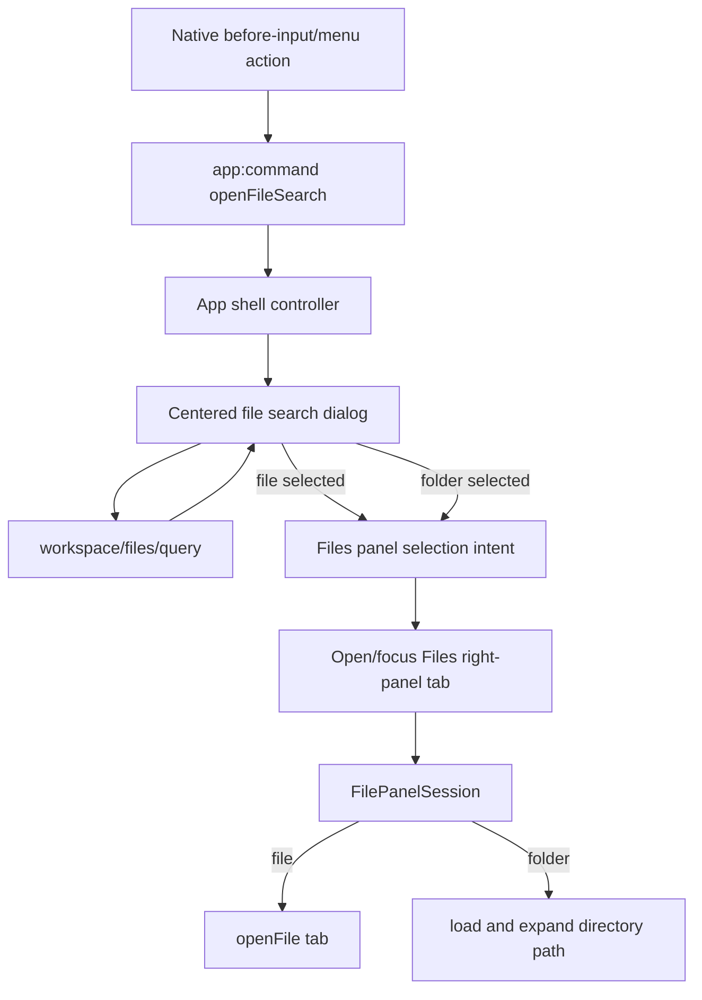

# feat: Add Cmd-P file search

## Summary

Add a centered Cmd-P file/folder launcher for the active workspace. The launcher searches workspace file-index entries, lets the user type and choose a file or folder from a combobox-style dialog, then opens the right-sidebar Files tab with the selected file opened in a file tab or the selected folder expanded in the tree.

**Target repos:** `roder-desktop` for the desktop UI and Electron command path; `roder` for the app-server workspace file query extension. Paths are repo-relative to the repo named in each file list.

---

## Problem Frame

The Files right-panel tab can already browse workspace roots, search paths inside its sidebar, expand folders, and open files in panel-local tabs. What is missing is a fast keyboard entry point that keeps the user in the current thread while jumping directly to a file or folder. This plan extends the existing Files panel model instead of creating a second file viewer or a broad global command palette.

---

## Requirements

**Launcher Entry**

- R1. Cmd-P on macOS and Ctrl-P off macOS opens a centered file search dialog for the active workspace.
- R2. The application menu exposes the same Find File action so the shortcut is discoverable and testable through the existing app-command path.
- R3. Opening the launcher focuses the search input and preserves normal text-entry behavior for composition, repeat, shift, and alt-modified keyboard events.

**Search and Selection**

- R4. The launcher searches workspace file-index entries by file and folder name/path, scoped to the active workspace.
- R5. Results distinguish files from folders and disambiguate duplicate relative paths across workspace roots.
- R6. Loading, empty, unavailable, and error states are visible in the dialog without blocking the rest of the app.
- R7. Selecting a file closes the dialog, opens or focuses the Files right-panel tab, and opens that file in a new or existing file tab.
- R8. Selecting a folder closes the dialog, opens or focuses the Files right-panel tab, and expands/reveals that folder in the file tree.

**Boundaries**

- R9. The feature remains a file/folder launcher only; commands, threads, models, settings, plugins, and full-text file content search stay out of scope.
- R10. The launcher uses the existing workspace-files API and does not add filesystem write, edit, git, or external-editor behavior.

---

## High-Level Technical Design

The native layer should only detect the shortcut and emit an app command. The renderer owns search, dialog state, workspace context, and the selection intent consumed by the mounted Files panel. This keeps Electron shortcut handling small and keeps file behavior near the existing Files tab state.

---

## Key Technical Decisions

- KTD1. **Use the existing app-command channel for Cmd-P:** `electron/main/shortcuts.ts`, `electron/main/index.ts`, and the preload `AppCommand` type already carry native commands into the renderer for Cmd-N, Cmd-O, and settings. Adding `openFileSearch` there keeps shortcut behavior testable and consistent.
- KTD2. **Keep the dialog renderer-owned and centered:** The dialog should follow the shadcn Base command pattern from `https://ui.shadcn.com/docs/components/base/command` using a `CommandDialog`-style composition: input, list, empty state, optional groups, and selectable items. Implement it through this repo's Base UI/local-wrapper conventions and `docs/design.md` defaults rather than adding Radix primitives.
- KTD3. **Extend the canonical workspace file query to include directories:** Use `workspace/files/query` through `roderIpc.queryWorkspaceFiles` rather than recursively walking the tree in the launcher. The backend currently ranks indexed files; it should also rank indexed directory entries so folder selection is real across the workspace, not limited to the currently loaded tree.
- KTD4. **Pass a transient selection intent into Files:** A selected launcher result should not become URL search state. File and folder selection are panel-local commands that should survive the immediate handoff without making file paths part of route state.
- KTD5. **Extend existing Files panel actions:** File selection should call the same open-tab path as tree selection. Folder selection should use the same directory-loading and expanded-tree path machinery as clicking a folder in the Files sidebar.
- KTD6. **Test behavior through public helpers and component output:** TDD is appropriate for shortcut recognition, result mapping, search state transitions, panel opening, and Files intent consumption. Desktop visual verification still needs the running Electron app because the renderer depends on preload APIs.

---

## Scope Boundaries

### In Scope

- Add a native app command and application menu item for Find File with `CommandOrControl+P`.
- Add a centered file/folder search dialog in the main app shell.
- Search active workspace file-index entries and render file/folder results with root/path context.
- Open/focus the Files right-panel tab after selection.
- Open file selections in Files panel tabs.
- Expand/reveal folder selections in the Files tree.

### Deferred to Follow-Up Work

- General command palette sources such as commands, settings, threads, models, plugins, and extensions.
- Full-text content search, match previews, or fuzzy ranking beyond the existing workspace query behavior.
- Persisting the last launcher query or selected result across app restarts.
- Opening files in an external editor or adding edit/save/create/delete file operations.
- Encoding selected file or folder paths into the URL.

---

## System-Wide Impact

This feature crosses native shortcut handling, preload command typing, app-shell controller state, a new floating dialog, route-backed right-panel opening, Files panel internals, and the app-server workspace file query implementation. The backend change is small but load-bearing: without directory query matches, the desktop cannot reliably offer folder selection from Cmd-P.

---

## Risks & Dependencies

- **Shortcut conflict:** `CommandOrControl+P` is traditionally Print. The app does not currently expose print behavior, so Find File can claim it, but the menu label should make the behavior discoverable.
- **Directory query coverage:** `workspace/files/query` currently ranks indexed files, while `workspace/files/children` exposes directories. The app-server query should include directories before the desktop ships folder selection.
- **Stale index behavior:** Query can report loading, stale, or failed status. The dialog should mirror Files-panel unavailable/loading/error language instead of presenting blank results.
- **Focus recovery:** Closing the dialog after Escape or selection should not strand focus; returning focus to the previous active surface or composer is preferable where local patterns support it.

---

## Implementation Units

### U1. Add the Find File App Command

**Goal:** Deliver Cmd-P/Ctrl-P and menu activation to the renderer as a typed `openFileSearch` app command.

**Requirements:** R1, R2, R3

**Dependencies:** None

**Files:**

- `electron/main/shortcuts.ts`
- `electron/main/index.ts`
- `electron/preload/index.ts`
- `src/types/roder.ts`
- `test/desktop-shortcuts.test.ts`

**Approach:** Extend the `AppCommand` union with `openFileSearch`, add a shortcut recognizer for key `p`/`KeyP`, install it alongside existing app-window shortcuts, and add a menu item labeled for file finding with `CommandOrControl+P`. Reuse `isShortcutInputForKey` so repeat/composition/shift/alt behavior remains consistent with other shortcuts.

**Execution note:** Start with failing shortcut/menu tests before changing the Electron command union.

**Patterns to follow:** `isNewThreadShortcutInput`, `installOpenSettingsShortcut`, `createApplicationMenuTemplate`, and preload `onAppCommand`.

**Test scenarios:**

- Given Command+P on macOS, the shortcut recognizer returns true and the installed handler sends `openFileSearch`.
- Given Control+P off macOS, the shortcut recognizer returns true and the installed handler sends `openFileSearch`.
- Given repeat, composing, Shift+P, Alt+P, key-up, or the wrong platform modifier, the shortcut recognizer returns false.
- Given the application menu is created, the Find File item has accelerator `CommandOrControl+P` and emits `openFileSearch` when clicked.

**Verification:** Desktop shortcut tests prove the native command is exposed without regressing existing shortcuts.

### U2. Include Directories in Workspace File Query

**Goal:** Make the app-server workspace query return ranked directory entries as well as file entries.

**Requirements:** R4, R5, R8

**Dependencies:** None

**Files (roder):**

- `crates/roder-app-server/src/workspace_files.rs`
- `crates/roder-app-server/tests/e2e.rs`
- `crates/roder-protocol/src/lib.rs`
- `docs/app-server/api.md`
- `docs/app-server/protocol.md`
- `sdk/fixtures/fake-app-server/workspace-files-flow.jsonl`

**Approach:** Extend the existing `RootIndex::query` candidate set to score directory paths from the in-memory directory index alongside file paths. Preserve the current result shape by returning `WorkspaceFileEntry` with `kind: "directory"`, `hasChildren`, no size, and the same `score`/`matchPositions` fields. Update protocol documentation and fixtures only where generated or hand-maintained contract artifacts require it.

**Execution note:** Start with a backend e2e assertion that querying a directory name returns a directory match before wiring desktop folder selection.

**Patterns to follow:** `RootIndex::children`, `IndexedFile::entry`, `sort_entries`, and `workspace_files_rebuild_children_query_and_read_flow`.

**Test scenarios:**

- Given an indexed directory with files beneath it, querying the directory name returns a directory match with `kind: "directory"` and `hasChildren: true`.
- Given an empty directory that is only surfaced by `workspace/files/children`, querying that directory does not return a false match unless the implementation intentionally indexes empty directories too.
- Given a query matches both a directory and a file, results remain ranked by score, then shorter path, then path.
- Given `rootId` is provided, directory query matches are limited to that root.
- Given existing file-query behavior, file matches and `indexedFileCount` remain compatible with current clients.

**Verification:** Backend e2e and protocol tests prove query results can drive both desktop file and folder launcher rows.

### U3. Build Search Result Helpers for the Launcher

**Goal:** Convert workspace query matches into launcher results that can render and act on files and folders safely.

**Requirements:** R4, R5, R6, R7, R8, R10

**Dependencies:** U2

**Files:**

- `src/lib/file-panel/search-launcher.ts`
- `src/lib/file-panel.ts`
- `test/file-panel-search-launcher.test.ts`
- `test/file-panel-fixtures.ts`

**Approach:** Add pure helpers for result identity, display title, path subtitle, root label lookup, result kind, and selection conversion back to `FilePanelIndexedPath`. Preserve root id and relative path as the stable identity so duplicate paths across roots stay distinct.

**Execution note:** Implement helper behavior test-first because these helpers define the selection contract consumed by both dialog and Files panel.

**Patterns to follow:** `filePanelRootItems`, `workspaceFilesEntriesToIndexedPaths`, `filePanelSelectionKey`, and existing file-panel fixture style.

**Test scenarios:**

- Given a file query match, the helper returns a file result with a stable root-aware key and a selection compatible with `openFile`.
- Given a directory query match, the helper returns a folder result with `kind: "directory"` and preserves `hasChildren`.
- Given duplicate `README.md` matches in different roots, result keys and subtitles disambiguate them by root.
- Given an empty relative path directory root, the helper produces a readable root result instead of an empty title.
- Given a malformed entry without a root id or valid kind, the helper drops it rather than producing an unsafe selection.

**Verification:** Pure unit tests prove launcher result mapping without rendering the dialog.

### U4. Add the Centered File Search Dialog

**Goal:** Render a centered combobox-style dialog that searches the active workspace and returns a selected file or folder.

**Requirements:** R1, R3, R4, R5, R6, R7, R8, R9

**Dependencies:** U3

**Files:**

- `src/components/file-search-dialog.tsx`
- `src/components/ui/dialog.tsx`
- `src/components/ui/combobox.tsx`
- `src/lib/file-panel/search-launcher.ts`
- `test/file-search-dialog.test.ts`

**Approach:** Compose the local Base UI dialog and command/combobox primitives into a centered search surface modeled on the shadcn Base command documentation: a command dialog with a single input, scrollable list, empty state, and selectable rows for files and folders. Query `roderIpc.queryWorkspaceFiles` only when the dialog is open, the workspace is available, and the trimmed query is non-empty. Show recent loaded results only if implementation can source them naturally; otherwise the first version may start empty until the user types.

**Patterns to follow:** `https://ui.shadcn.com/docs/components/base/command` for command dialog composition; `src/components/ui/dialog.tsx`, `src/components/ui/combobox.tsx`, `src/components/command-completion-popup.tsx`, `src/components/composer-completion-popup.tsx`, and `docs/design.md` dialog surface guidance.

**Test scenarios:**

- Given the dialog opens, the search input is rendered and receives focus.
- Given the user types `read`, the dialog calls `queryWorkspaceFiles` with the active workspace id, query `read`, and a bounded limit.
- Given query results include files and folders, the list renders different visual affordances and accessible labels for both kinds.
- Given the query is blank, unavailable, loading, failed, or has no matches, the dialog shows the matching state without calling a selection handler.
- Given the user selects a file result, the dialog calls the selection handler with a file indexed path and closes.
- Given the user selects a folder result, the dialog calls the selection handler with a directory indexed path and closes.
- Given Escape closes the dialog, no selection handler is called.
- Given a stale query resolves after a newer query, the stale results do not replace the newer state.

**Verification:** Component tests cover search lifecycle, accessibility-visible states, and selection outputs.

### U5. Wire the Launcher into App Shell State

**Goal:** Open the dialog from the app command and hand selected results to the right-panel Files tab.

**Requirements:** R1, R6, R7, R8, R9

**Dependencies:** U1, U4

**Files:**

- `src/hooks/use-app-shell-controller.ts`
- `src/components/app-shell-layout.tsx`
- `src/components/right-workspace-panel-registry.tsx`
- `src/components/app-shell-context.tsx`
- `src/lib/route-search.ts`
- `test/app-shell-layout.test.ts`
- `test/route-search.test.ts`

**Approach:** Add state for dialog visibility and a transient file-panel selection intent in the app-shell controller. When `openFileSearch` arrives through `onAppCommand`, open the dialog. When a result is selected, set the intent and call `openWorkspacePanelTab(current, "files")` with replace history, leaving route search state responsible only for opening/focusing the panel.

**Patterns to follow:** `openWorkspacePanel`, `openReview`, design-canvas notification auto-open behavior, and the existing route helpers for panel tab lifecycle.

**Test scenarios:**

- Given an `openFileSearch` app command is received, the layout renders the dialog.
- Given a file result is selected, route state opens or focuses the Files panel without duplicating the tab.
- Given a folder result is selected, route state opens or focuses the Files panel without duplicating the tab.
- Given the right panel is too narrow to render and the shell closes itself, the selection intent is not lost until Files can consume or clear it during implementation.
- Given the workspace has no file API support, the dialog opens into an unavailable state rather than issuing query calls.

**Verification:** App shell tests prove command-to-dialog and selection-to-panel handoff without relying on a browser against the Vite renderer.

### U6. Consume File and Folder Intents in the Files Panel

**Goal:** Make the existing Files panel respond to launcher selections by opening files and expanding folders.

**Requirements:** R7, R8

**Dependencies:** U5

**Files:**

- `src/components/file-panel.tsx`
- `src/components/file-panel/file-panel-sidebar.tsx`
- `src/components/file-panel/use-open-file-tabs.ts`
- `src/hooks/use-file-panel-tree.ts`
- `src/lib/file-panel/tree.ts`
- `test/file-panel-ui.test.ts`
- `test/file-panel-tree.test.ts`

**Approach:** Add an optional selection-intent prop to `FilePanel` or a narrow handler context in the right-panel render path. Files should consume each intent once. For file intents, call the existing `openFile` path. For folder intents, compute the tree path, add every ancestor directory to expanded paths, load any needed children in order where possible, and select or reveal the target folder after paths are available.

**Execution note:** Add characterization coverage around current file-tab opening and folder expansion before changing the Files panel handoff.

**Patterns to follow:** `openDirectory` in `FilePanelSession`, `filePanelTreePathForIndexedPath`, `filePanelTreeInitialExpandedPaths`, and `loadDirectory` in `useFilePanelTree`.

**Test scenarios:**

- Given a file intent for an unopened file, Files opens a new file tab and marks it active.
- Given a file intent for an already open file, Files focuses the existing tab without duplicating it.
- Given a folder intent for a loaded folder, Files expands the folder tree path and keeps the Files tab active.
- Given a folder intent for a nested folder whose parents are not loaded yet, Files loads the ancestor chain before revealing the folder.
- Given a folder read fails while handling an intent, Files keeps existing tree state and shows the directory error instead of dropping the intent silently.
- Given the workspace changes before an intent is consumed, Files ignores stale intents whose root id is no longer present.
- Given the Files panel remounts after workspace identity changes, old selection intents do not replay.

**Verification:** File-panel tests prove launcher selections reuse existing file tabs and directory expansion logic.

### U7. Polish Interaction and Verify Desktop Behavior

**Goal:** Finish focus, layout, keyboard navigation, and desktop-shell verification for the launcher and Files handoff.

**Requirements:** R1, R3, R5, R6, R7, R8

**Dependencies:** U1, U2, U3, U4, U5, U6

**Files:**

- `src/components/file-search-dialog.tsx`
- `src/components/app-shell-layout.tsx`
- `src/style.css`
- `test/file-search-dialog.test.ts`
- `test/file-panel-ui.test.ts`

**Approach:** Tune dialog width, max height, row density, keyboard navigation, disabled states, root/path metadata, and focus return. Keep the visual language consistent with `docs/design.md`: white popover surface, subtle ring/shadow, `text-base` defaults, compact metadata, stable row heights, and no nested card styling.

**Patterns to follow:** Local dialog and combobox wrappers, completion popup row density, Files tab icon usage, and design checklist guidance for desktop UI.

**Test scenarios:**

- Given the result list overflows, keyboard navigation keeps the highlighted result visible without changing dialog size.
- Given long file names or paths, row text truncates without overlapping icons or metadata.
- Given the dialog closes after selection, focus returns to a sensible app surface and the selected Files panel remains usable by keyboard.
- Given the user runs the feature in the Electron app, Cmd-P opens the centered launcher, file selection opens a file tab, and folder selection expands the tree.

**Verification:** Targeted tests pass, typecheck passes, and the user verifies the final behavior in the running desktop app because plain browser automation can be misleading for this Electron renderer.

---

## Acceptance Examples

- AE1. Given a user presses Cmd-P on macOS while viewing a thread, when the app receives the shortcut, then a centered file search dialog opens with the input focused.
- AE2. Given the user types part of a file path and selects a file result, then the dialog closes, the right sidebar opens to Files, and the file opens in an active file tab.
- AE3. Given the user types part of a folder path and selects a folder result, then the dialog closes, the right sidebar opens to Files, and the folder is expanded in the tree.
- AE4. Given two workspace roots contain the same relative path, then the launcher distinguishes the results and opens the selected root's file or folder.
- AE5. Given the workspace file index is unavailable or failed, then the launcher shows a non-destructive unavailable/error state and does not crash.

---

## Sources & Research

- `docs/design.md` sets the UI defaults for dialogs, pickers, typography, surfaces, radii, focus, and desktop visual verification.
- `electron/main/shortcuts.ts`, `electron/main/index.ts`, and `electron/preload/index.ts` show the existing native app-command path for desktop shortcuts and menu commands.
- `src/hooks/use-app-shell-controller.ts` and `src/lib/route-search.ts` show how right-panel tabs are opened and focused through URL-backed state.
- `src/components/file-panel.tsx`, `src/components/file-panel/use-open-file-tabs.ts`, `src/hooks/use-file-panel-tree.ts`, and `src/components/file-panel/file-panel-sidebar.tsx` show the existing Files tab state, file-tab opening, directory loading, and tree expansion patterns.
- `src/components/ui/dialog.tsx` and `src/components/ui/combobox.tsx` provide the Base UI wrappers required by project guidance.
- `https://ui.shadcn.com/docs/components/base/command` provides the requested command dialog composition reference for the file-search launcher.
- In the `roder` repo, `crates/roder-app-server/src/workspace_files.rs` shows that `workspace/files/query` currently queries files, while `workspace/files/children` already synthesizes directory entries.
- In the `roder` repo, `docs/app-server/api.md` names `workspace/files/query` as the intended command-p quick-open method.
- `docs/plans/2026-06-04-001-feat-file-view-panel-plan.md` records the prior Files tab plan and its intentional boundary around read-only file browsing.
